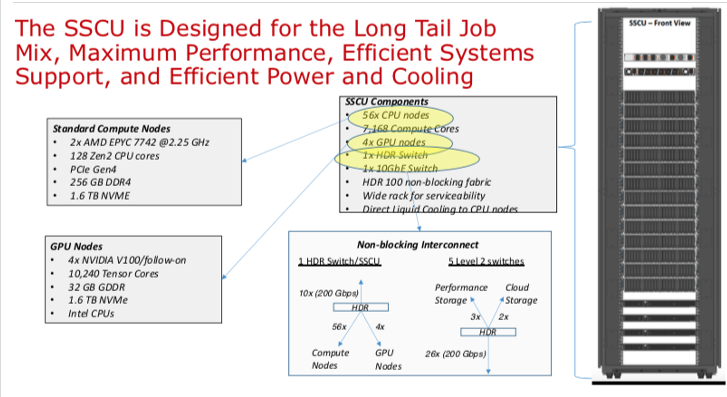
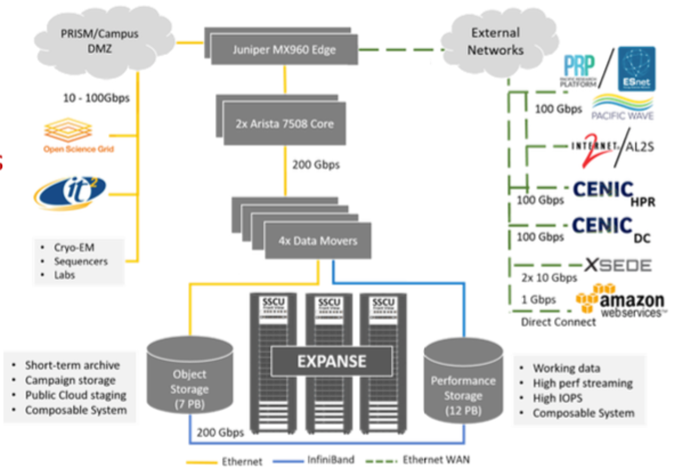
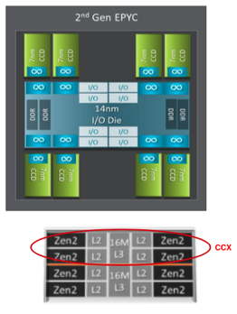
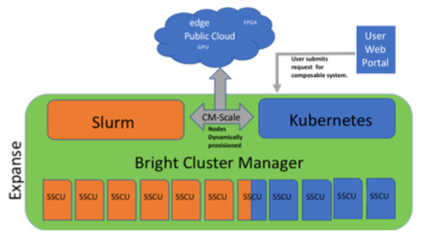
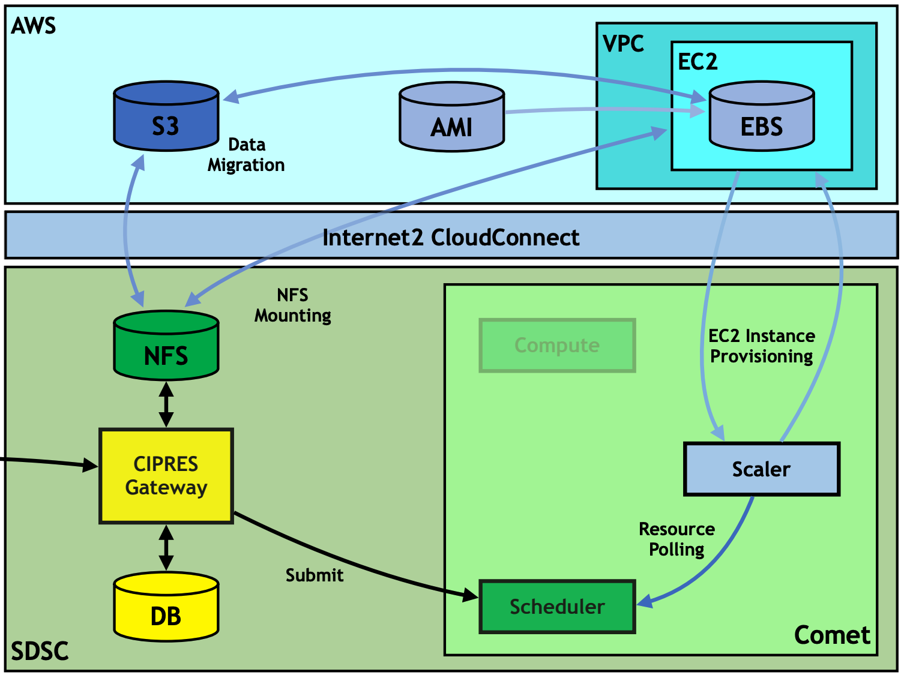
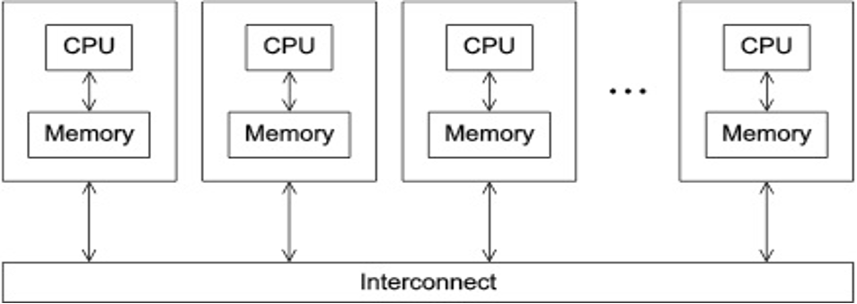
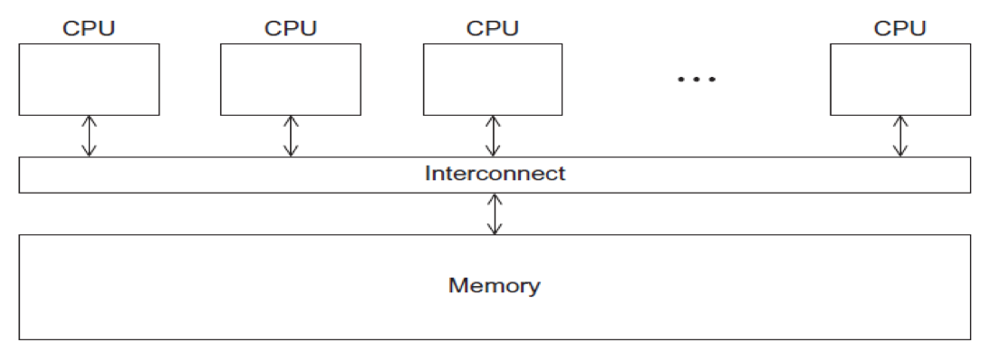
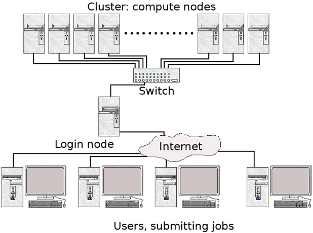
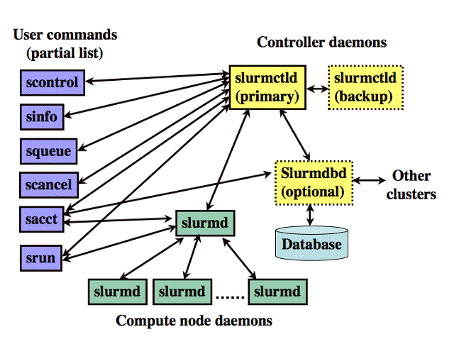

## Expanse 101 Tutorial

[SDSC HPC Training Group](https://www.sdsc.edu/education_and_training/training_hpc.html)

*Document last updated:  06/16/24*

<hr>
The [Expanse system](https://expanse.sdsc.edu) is an NSF-funded system that was made available through the eXtreme Science and Engineering Discovery Environment (XSEDE) program, and is now part of the NSF Advanced Cyberinfrastructure Coordination Ecosystem: Services & Support [ACCESS program](https://www.access-ci.org).

In this tutorial, you will learn how to compile and run jobs on Expanse,
where to run them, and how to run batch jobs. The commands below can be
cut & pasted into the terminal window, when it is connected to
expanse.sdsc.edu.

## Misc Notes/Updates:
* In August of 2022, the NSF ACCESS program was launched.
ACCESS is designed to replace the XSEDE project. For more information, see: https://access-ci.org*
*  You must have an Expanse account in order to access the system.
   * To obtain an account, users may submit a proposal through the ACCESS Allocation Request System at https://access-ci.org/about/get-started/#start, or request a Trial Account from SDSC: consult@sdsc.edu.
   * For more details, see https://www.sdsc.edu/support/user_guides/expanse.html#access
*  You must be familiar with running basic Unix commands: see the
   following tutorials at:
   *  https://github.com/sdsc-hpc-training-org/basic_skills
*  Additional programming examples can be found here:  https://github.com/sdsc-hpc-training-org/hpctr-examples
*  __Some basic Expanse Information:__

  
   | Description  |  Resource |
   | ------ | ----- |
   | login node name | login.expanse.sdsc.edu |
   | hostnames for Expanse| login01 , or   login02 |
   | Operating system |  CentOS |
   | Cluster management system | Bright Cluster Manager |
   | Scheduler and Resource Manager | SLURM |


If you have any difficulties completing these tasks, please contact SDSC
Consulting group at consult@sdsc.edu.

<a name="top">Contents:
* [Expanse Overview & Innovative Features](#overview)
* [Getting Started](#get-start)
   * [Obtaining Expanse Accounts](#geting-started-expanse-accounts)
   * [Logging Onto Expanse](#geting-started-expanse-logon)
   * [Obtaining Example Code](#geting-started-example-code)
   * [Expanse User Portal](#geting-started-exp-port)
* [Modules](#modules)
   * [Introduction to the Lua Lmod Module System](#module-lmod-intro)
   * [Modules: Popular Lmod Commands](#module-commands)
   * [Load and Check Modules and Environment](#load-and-check-module-env)
   * [Loading Modules During Login](#module-login-load)
   * [Saving Module Schemes](#module-schemes)
   * [Troubleshooting](#module-troubleshoot)
* [Managing Accounts](#managing-accounts)
   * [Expanse Client Script](#manage-accts-client-script)
   * [Using Accounts in Batch Jobs](#manage-accts-batch-script)
   * [Managing Users on an Account](#manage-accts-users)  
* [Job Charging](#job-charging)
* [Compiling & Linking](#compilers)
   * [Supported Compilers](#compilers-supported")
   * [AMD Optimizing C/C++ Compiler (AOCC)](#compilers-amd)
   * [Intel Compilers](#compilers-intel)
   * [GNU Compilers](#compilers-gnu)
   * [PGI Compilers](#compilers-pgi)
* [Running Jobs](#run-jobs)
   * [Parallel Models](#run-jobs-par-models)
   * [Methods for  Running Jobs on Expanse](#run-jobs-methods)
      * [Batch Jobs](#run-jobs-methods-batch)
      * [Interactive Jobs](#run-jobs-methods-ineractive)
   * [Slurm Resource Manager](#run-jobs-slurm)
      * [Slurm Job Status States](#run-jobs-slurm-status)
      * [Slurm Partitions](#run-jobs-slurm-partition)
      * [Slurm Commands](#run-jobs-slurm-commands)
      * [Slurm Batch Script Example](#run-jobs-slurm-batch)
* [Compiling and Running CPU Jobs](#comp-and-run-cpu-jobs)
   * [Checking Your Environment](#check-env)
   * [Hello World (MPI)](#hello-world-mpi)
        * [Hello World (MPI): Source Code](#hello-world-mpi-source)
        * [Hello World (MPI): Compiling](#hello-world-mpi-compile)
        * [Hello World (MPI): Batch Script Submission](#hello-world-mpi-batch-submit)
        * [Hello World (MPI): Batch Script Output](#hello-world-mpi-batch-output)
        * [Hello World (MPI): Interactive Jobs](#hello-world-mpi-interactive)
   * [Hello World (OpenMP)](#hello-world-omp)
        * [Hello World (OpenMP): Source Code](#hello-world-omp-source)
        * [Hello World (OpenMP): Compiling](#hello-world-omp-compile)
        * [Hello World (OpenMP): Batch Script Submission](#hello-world-omp-batch-submit)
        * [Hello World (OpenMP): Batch Script Output](#hello-world-omp-batch-output)
   * [Compiling and Running Hybrid (MPI + OpenMP) Jobs](#hybrid-mpi-omp)
        * [Hybrid (MPI + OpenMP): Source Code](#hybrid-mpi-omp-source)
        * [Hybrid (MPI + OpenMP): Compiling](#hybrid-mpi-omp-compile)
        * [Hybrid (MPI + OpenMP): Batch Script Submission](#hybrid-mpi-omp-batch-submit)
        * [Hybrid (MPI + OpenMP): Batch Script Output](#hybrid-mpi-omp-batch-output)
* [Compiling and Running GPU Jobs](#comp-run-gpu)
   * [Using Expanse GPU Nodes](#comp-run-gpu-nodes)
   * [Using Interactive GPU Nodes](#comp-run-gpu-interactive)
   * [Hello World (GPU-CUDA)](#hello-world-cuda-gpu)
       * [Hello World (GPU-CUDA): Source Code](#hello-world-cuda-source)
       * [Hello World (GPU-CUDA): Compiling](#hello-world-cuda-compile)
       * [Hello World (GPU-CUDA): Execute](#hello-world-execute)
       * [Hello World (GPU-CUDA): Batch Script Submission](#hello-world-cuda-batch-submit)
       * [Hello World (GPU-CUDA): Batch Script Output](#hello-world-cuda-batch-output)

   * [Vector Addition (GPU-CUDA)](#vec-add-cuda-gpu)
       * [Vector Addition (GPU-CUDA): Source Code](#vec-add-cuda-source)
       * [Vector Addition (GPU-CUDA): Compiling & Running](#vec-add-cuda-compile)
       * [Vector Addition (GPU-CUDA): Batch Script Submission](#vec-add-cuda-batch-submit)
       * [Vector Addition (GPU-CUDA): Batch Script Output](#vec-add-cuda-batch-output)
   * [Laplace2D (GPU/OpenACC)](#laplace2d-gpu)
       * [Laplace2D (GPU/OpenACC): Source Code](#laplace2d-gpu-source)
       * [Laplace2D (GPU/OpenACC): Compiling](#laplace2d-gpu-compile)
       * [Laplace2D (GPU/OpenACC): Batch Script Submission](#laplace2d-gpu-batch-submit)
       * [Laplace2D (GPU/OpenACC): Batch Script Output](#laplace2d-gpu-batch-output)


<hr>


## Expanse Overview <a name="overview"></a>

### HPC for the *long tail* of science:
* Designed by Dell and SDSC delivering 5.16 peak petaflops
* Designed and operated on the principle that the majority of computational research is performed at modest scale: large number jobs that run for less than 48 hours, but can be computationally intensvie and generate large amounts of data.
* An NSF-funded system that was made available through the eXtreme Science and Engineering Discovery Environment (XSEDE) program (https://www.xsede.org), which is now part of the NSF Advanced Cyberinfrastructure Coordination Ecosystem: Services & Support (ACCESS program).
* Supports interactive computing and science gateways.
* Will offer Composible Systems and Cloud Bursting.

<hr>


### System Summary

* 13 SDSC Scalable Compute Units (SSCU)
* 728 x 2s Standard Compute Nodes
* 93,184 Compute Cores
* 200 TB DDR4 Memory
* 52x 4-way GPU Nodes w/NVLINK
* 208 V100s | * 4x 2TB Large Memory Nodes
* HDR 100 non-blocking Fabric
* 12 PB Lustre High Performance
* Storage
  * 7 PB Ceph Object Storage
  * 1.2 PB on-node NVMe
* Dell EMC PowerEdge
* Direct Liquid Cooled


<hr>

### Expanse Scaleable Compute Unit



<hr>

### Expanse Connectivity Fabric



<hr>

### AMD EPYC 7742 Processor Architecture



* 8 Core Complex Dies (CCDs).
* CCDs connect to memory, I/O, and each other through the I/O Die.
* 8 memory channels per socket.
* DDR4 memory at 3200MHz.
* PCI Gen4, up to 128 lanes of high speed I/O.
* Memory and I/O can be abstracted into separate quadrants each with 2 DIMM channels and 32 I/O lanes.
* 2 Core Complexes (CCXs) per CCD
* 4 Zen2 cores in each CCX share a16ML3 cache. Total of 16x16=256MB L3 cache.
* Each core includes a private 512KB L2 cache.  

<hr>
### New Expanse Features

#### Composable Systems


Composable Systems will support complex, distributed, workflows – making Expanse part of a larger CI ecosystem.

* Bright Cluster Manager + Kubernetes
* Core components developed via NSF- funded CHASE-CI (NSF Award # 1730158), and the Pacific Research Platform (NSF Award # 1541349)
* Requests for a composable system will be part of an XRAC request
* Advanced User Support resources available to assist with projects - this is part of our operations funding.
  *  Webinar scheduled for April 2021. See: https://www.sdsc.edu/education_and_training/training_hpc.html


#### Cloud Bursting
Expanse will support integration with public clouds:

  

* Supports projects that share data, need access to novel technologies, and integrate cloud resources into workflows
* Slurm + in-house developed software + Terraform (Hashicorp)
* Early work funded internally and via NSF E-CAS/Internet2 project for CIPRES (Exploring Cloud for the Acceleration of Science, Award #1904444).
* Approach is cloud-agnostic and will support the major cloud providers.
* Users submit directly via Slurm, or as part of a composed system.
* Options for data movement: data in the cloud; remote mounting of file systems; cached filesystems (e.g., StashCache), and data transfer during the job.
* Funding for users cloud resources is not part of an Expanse award: the researcher must have access to cloud computing credits via other NSF awards and funding.


[Back to Top](#top)
<hr>


## <a name="get-start"></a>Getting Started on Expanse
In this Section:
* [Expanse Accounts](#geting-started-expanse-accounts)
* [Logging Onto Expanse](#geting-started-expanse-logon)
* [Obtaining Example Code](#geting-started-example-code)
* [Expanse User Portal](#geting-started-exp-port)


[Back to Top](#top)
<hr>ba

### Expanse Accounts<a name="geting-started-expanse-accounts"></a>
* You must have a expanse account in order to access the system.
* To obtain an account, users may submit a proposal through the [ACCESS Allocation Request System](https://access-ci.atlassian.net/)  or request a Trial Account from SDSC: consult@sdsc.edu.
   * For more details, see https://www.sdsc.edu/support/user_guides/expanse.html#access
* If you had an XSEDE account, it should have been migrated to the ACCESS System. For details, see: https://identity.access-ci.org/new-user
* Interested parties may contact the ACCESS Help Desk for help with an Expanse proposal. See: https://access-ci.atlassian.net/wiki/spaces/ACCESSdocumentation/pages/72417292

### Logging Onto Expanse<a name="geting-started-expanse-logon"></a>

Expanse supports Single Sign-On through the ACCESS Identity System (see: https://identity.access-ci.org/new-user), from the command line using an ACCESS-wide password. While CPU and GPU resources are allocated separately, the login nodes are the same. To log in to Expanse from the command line, use the hostname:

```
login.expanse.sdsc.edu
```

The following are examples of Secure Shell (ssh) commands that may be used to log in to Expanse:

```
ssh <username>@login.expanse.sdsc.edu
ssh -l <username> login.expanse.sdsc.edu
```
Details about how to access Expanse under different circumstances are described in the Expanse User Guide:
https://www.sdsc.edu/support/user_guides/expanse.html#access

For instructions on how to use SSH,
see [Connecting to SDSC HPC Systems Guide](https://github.com/sdsc-hpc-training-org/hpc-security). Below is the logon message – often called the *MOTD* (message of the day, located in /etc/motd). This has not been implemented at this point on Expanse

```
[username@localhost:~] ssh -Y username@login.expanse.sdsc.edu
Welcome to Bright release         9.0

                                                         Based on Rocky Linux 8
                                                                    ID: #000002
--------------------------------------------------------------------------------

                                 WELCOME TO
                  _______  __ ____  ___    _   _______ ______
                 / ____/ |/ // __ \/   |  / | / / ___// ____/
                / __/  |   // /_/ / /| | /  |/ /\__ \/ __/
               / /___ /   |/ ____/ ___ |/ /|  /___/ / /___
              /_____//_/|_/_/   /_/  |_/_/ |_//____/_____/

--------------------------------------------------------------------------------

Use the following commands to adjust your environment:

'module avail'            - show available modules
'module add <module>'     - adds a module to your environment for this session
'module initadd <module>' - configure module to be loaded at every login

-------------------------------------------------------------------------------
Last login: Mon Apr 10 15:47:22 2023 from 12.34.56.789

```

#### Example of a terminal connection/Unix login session:

```
localhost:~ user$ sssh -Y username@login.expanse.sdsc.edu
Last login: Mon Apr 10 15:47:22 2023 from 12.34.56.789
[username@login02 ~]$
[username@login02 ~]$ whoami
username
[username@login02 ~]$ hostname
login01
[username@login02 ~]$ pwd
/home/username
[username@login02 ~]$
```
[ [Back to Getting Started](#get-start) ] [ [Back to Top](#top) ]
<hr>

### Obtaining Tutorial Example Code<a name="geting-started-example-code"></a>
We will clone the example code from GitHub repository using anonymous HTTPS downloads from GitHub. 
https://github.com/sdsc-hpc-training-org/hpctr-examples.git

Note that GitHub has increased it's security requirements, and you may have to deal with that. See: https://docs.github.com/en/authentication

* Create a test directory hold the expanse example files (optional):

```
[username@login01] ~]$ git clone https://github.com/sdsc-hpc-training-org/expanse-101.git
Cloning into 'hpctr-examples'...
Warning: untrusted X11 forwarding setup failed: xauth key data not generated
remote: Enumerating objects: 352, done.
remote: Counting objects: 100% (352/352), done.
remote: Compressing objects: 100% (227/227), done.
remote: Total 352 (delta 128), reused 334 (delta 119), pack-reused 0
Receiving objects: 100% (352/352), 27.62 MiB | 19.88 MiB/s, done.
Resolving deltas: 100% (128/128), done.
Updating files: 100% (310/310), done.
[username@login01] ~]$ cd hpctr-examples/
[username@login01] hpctr-examples]$ ll
total 272
drwxr-xr-x 12 username use300    15 Apr 10 22:26 .
drwxr-x--- 41 username use300    63 Apr 10 22:26 ..
drwxr-xr-x  9 username use300    10 Apr 10 22:26 basic_par
drwxr-xr-x  3 username use300     9 Apr 10 22:26 calc-prime
drwxr-xr-x  6 username use300     7 Apr 10 22:26 cuda
drwxr-xr-x  2 username use300     5 Apr 10 22:26 env_info
drwxr-xr-x  8 username use300    13 Apr 10 22:26 .git
-rw-r--r--  1 username use300  1799 Apr 10 22:26 .gitignore
drwxr-xr-x  2 username use300     9 Apr 10 22:26 hybrid
-rw-r--r--  1 username use300 35149 Apr 10 22:26 LICENSE
drwxr-xr-x  4 username use300     4 Apr 10 22:26 mkl
drwxr-xr-x  2 username use300    15 Apr 10 22:26 mpi
drwxr-xr-x  2 username use300    17 Apr 10 22:26 openacc
drwxr-xr-x  2 username use300     8 Apr 10 22:26 openmp
-rw-r--r--  1 username use300  5772 Apr 10 22:26 README.md

```

*Note*: you can learn to create and modify directories as part of the *Getting Started* and *Basic Skills* preparation found here:
https://github.com/sdsc-hpc-training-org/basic_skills

The examples directory contains the code we will cover in this tutorial:

```
[username@login01] examples]$ ll
total 141
drwxr-xr-x 9 user abc123  9 Jan 28 22:44 .
drwxr-xr-x 5 user abc123  10 Jan 28 22:44 ..
drwxr-xr-x 6 user abc123   7 Jan 28 22:44 CUDA
drwxr-xr-x 6 user abc123   7 Jan 28 22:39 cuda-samples
drwxr-xr-x 2 user abc123   3 Jan 28 22:39 ENV_INFO
drwxr-xr-x 2 user abc123   6 Jan 28 22:39 HYBRID
drwxr-xr-x 2 user abc123   6 Jan 28 22:39 MPI
drwxr-xr-x 2 user abc123   6 Jan 28 22:39 OpenACC
drwxr-xr-x 2 user abc123   6 Jan 28 22:39 OPENMP

```
All examples will contain source code, along with a batch script example so you can compile and run all examples on Expanse. Optionally, you can clone the tutorial as well:   https://github.com/sdsc-hpc-training-org/expanse-101.git

[ [Back to Getting Started](#get-start) ] [ [Back to Top](#top) ]
<hr>

### Expanse User Portal<a name="geting-started-exp-port"></a>


The Expanse User portal provides a quick and easy way for Expanse users . Features include:
* Logging in, transfering and editing files
* Submitting and monitoring jobs
* Running HPC applications
* Launching interactive applications such as MATLAB, Rstudio and Jupyter Notebooks.
* Integrated web-based environment for file management and job submission.
* All Users with valid Expanse Allocation and ACCESS Based credentials have access via their ACCESS credentials..
* See: https://portal.expanse.sdsc.edu

Note that before you can access the Expanse Portal, you will need to authenticate (as shown in the image below). Most users will select the organization labeled "ACCESS CI (formerly XSEDE)" for login. Contact SDSC consulting (consult@sdsc.edu) if you have trouble authenticating.


[ [Back to Getting Started](#get-start) ] [ [Back to Top](#top) ]
<hr>


## <a name="modules"></a>Environment Modules: Customizing Your User Environment
The Environment Modules package provides for dynamic modification of your shell environment. Module commands set, change, or delete environment variables, typically in support of a particular application. They also let the user choose between different versions of the same software or different combinations of related codes. See the [Expanse User Guide](https://www.sdsc.edu/support/user_guides/expanse.html#modules).

In this Section:
* [Introduction to the Lua Lmod Module System](#module-lmod-intro)
* [Popular Lmod Commands](module-commands)
* [Load and Check Modules and Environment](#load-and-check-module-env)
* [Loading Modules During Login](#module-login-load)
* [Saving Module Schemes](#module-schemes)
* [Troubleshooting](#module-troubleshoot)

<!----
* comment
---->

[Back to Top](#top)
<hr>

### Introduction to the Lua Lmod Module System<a name="module-lmod-intro"></a>
* Expanse uses Lmod, a Lua based module system.
   * See: [https://lmod.readthedocs.io/en/latest/010_user.html](https://lmod.readthedocs.io/en/latest/010_user.html)
* Users setup custom environments by loading available modules into the shell environment, including needed compilers and libraries and the batch scheduler.
* What’s the same as Comet:
  * Dynamic modification of your shell environment
  * User can set, change, or delete environment variables
  * User chooses between different versions of the same software or different combinations of related codes.
* Modules: What’s Different?
  * *Users will need to load the scheduler (e.g. Slurm)*
  * Depending on which hardware users are working on, *users will need to load either the ```gpu``` or ```cpu``` modules*.
  * Users will not see all available modules when they run command "module available" without loading a compiler.
  * Use the command "module spider" option to see if a particular package exists and can be loaded, run command
      * module spider <package>
      * module keywords <term>
  * For additional details, and to identify module dependencies modules, use the command
      * module spider <application_name>
  * The module paths are different for the CPU and GPU nodes. Users can enable the paths by loading the following modules:               
      * module load cpu  (for cpu nodes)
      * module load gpu  (for gpu nodes)     
      * note: avoid loading both modules


[ [Back to Modules](#modules) ] [ [Back to Top](#top) ]
<hr>

### Modules: Popular Lmod Commands<a name="module-commands"></a>

Here are some common module commands and their descriptions:

| Lmod Command | Description |
|:--- | :--- |
|module purge | Remove all modules that are currently loaded|
|module list | List the modules that are currently loaded|
|module avail | List the modules that are available in environment|
|module spider | List of the modules and extensions currently available|
|module display <module_name> | Show the environment variables used by <module name> and how they are affected|
|module unload <module name> | Remove <module name> from the environment|
|module load <module name> | Load <module name> into the environment|
|module swap <module one> <module two> | Replace <module one> with <module two> in the environment|
|module  save <name> | Save the current list of modules to "name" collection. |
| savelist | List of saved module collections. |
|  describe  <name> | Describe the contents of a module collection. |
|module help | Get a list of all the commands that module knows about do:

Lmod commands support *short-hand* notation, for example:

```
   ml foo == module load foo
   ml -bar”  == module unload bar
```
*SDSC Guidance:   `add module calls to your environment and batch scripts`*


<b> A few module command examples:</b>

* Default environment for a new user/new login: `list`, `li`

```
[username@login01] expanse-101]$ module list
Currently Loaded Modules:
1) shared   2) slurm/expanse/20.02.3   3) cpu/0.15.4   4) DefaultModules
```

* List available modules:  `available`, `avail`, `av`

```
$ module av
[username@expanse-ln3:~] module av
[username@login01] expanse-101]$ module available

--------------- /cm/shared/apps/spack/cpu/lmod/linux-centos8-x86_64/Core ----------------
   abaqus/2018     gaussian/16.C.01        gmp/6.1.2           mpfr/4.0.2
   aocc/2.2.0      gcc/7.5.0               intel/19.1.1.217    openjdk/11.0.2
   cmake/3.18.2    gcc/9.2.0               libtirpc/1.2.6      parallel/20200822
   emboss/6.6.0    gcc/10.2.0       (D)    matlab/2020b        subversion/1.14.0

--------------------------------- /cm/local/modulefiles ---------------------------------
   cluster-tools-dell/9.0        gcc/9.2.0                    null
   cluster-tools/9.0             gpu/1.0                      openldap
   cmd                           ipmitool/1.8.18              python3
   cmjob                         kubernetes/expanse/1.18.8    python37
   cpu/1.0                (L)    lua/5.3.5                    shared                (L)
   docker/19.03.5                luajit                       singularitypro/3.5
   dot                           module-git                   slurm/expanse/20.02.3
   freeipmi/1.6.4                module-info

-------------------------------- /usr/share/modulefiles ---------------------------------
   DefaultModules (L)    gct/6.2    globus/6.0

-------------------------------- /cm/shared/modulefiles ---------------------------------
   bonnie++/1.98                default-environment           netperf/2.7.0
   cm-pmix3/3.1.4               gdb/8.3.1                     openblas/dynamic/0.3.7
   cuda10.2/blas/10.2.89        hdf5/1.10.1                   openmpi/gcc/64/1.10.7
   cuda10.2/fft/10.2.89         hdf5_18/1.8.21                sdsc/1.0
   cuda10.2/nsight/10.2.89      hwloc/1.11.11                 ucx/1.6.1
   cuda10.2/profiler/10.2.89    iozone/3_487
   cuda10.2/toolkit/10.2.89     netcdf/gcc/64/gcc/64/4.7.3

  Where:
   L:  Module is loaded
   D:  Default Module

```

*Note:* Module defaults are chosen based on *Find First Rules* due to Name/Version/Version modules found in the module tree.
See https://lmod.readthedocs.io/en/latest/060_locating.html for details.

Use ```module spider``` to find all possible modules and extensions.

```
[username@login02 ~]$ module spider MPI
[username@login01] hpctr-examples]$ module spider MPI

----------------------------------------------------------------------------
  intel-mpi: intel-mpi/2019.8.254
----------------------------------------------------------------------------

    You will need to load all module(s) on any one of the lines below before the "intel-mpi/2019.8.254" module is available to load.

      cpu/0.15.4  gcc/10.2.0
      cpu/0.15.4  gcc/9.2.0
      cpu/0.15.4  intel/19.1.1.217
      gpu/0.15.4
      gpu/0.15.4  intel/17.0.7
      gpu/0.15.4  intel/19.0.5.281
      gpu/0.15.4  pgi/20.4
 
    Help:
      Intel MPI


----------------------------------------------------------------------------
  intel-mpi/2019.10.317:
----------------------------------------------------------------------------
     Versions:
        intel-mpi/2019.10.317/ezrfjne
        intel-mpi/2019.10.317/jhyxn2g
        intel-mpi/2019.10.317/kdx4qap
        intel-mpi/2019.10.317/uwgziob

----------------------------------------------------------------------------
  For detailed information about a specific "intel-mpi/2019.10.317" package (including how to load the modules) use the module's full name. Note that names that have a trailing (E) are extensions provided by other modules.
  For example:

     $ module spider intel-mpi/2019.10.317/uwgziob
----------------------------------------------------------------------------

----------------------------------------------------------------------------
  mpip: mpip/3.4.1
----------------------------------------------------------------------------

    You will need to load all module(s) on any one of the lines below before the "mpip/3.4.1" module is available to load.

      cpu/0.15.4  gcc/10.2.0  openmpi/4.0.4
      cpu/0.15.4  gcc/10.2.0  openmpi/4.0.4-openib
 
    Help:
      mpiP: Lightweight, Scalable MPI Profiling
----------------------------------------------------------------------------
  mpip/3.5:
----------------------------------------------------------------------------
     Versions:
        mpip/3.5/aowedam
        mpip/3.5/blkwu65
        mpip/3.5/mjhw2bi
        mpip/3.5/o2hhyev
        mpip/3.5/owpz5hl
        mpip/3.5/plw5vw6
        mpip/3.5/useousx
        mpip/3.5/w64qya2
        mpip/3.5/x4p5f6i
        mpip/3.5/3g6o4ug
        mpip/3.5/7nngdrh

----------------------------------------------------------------------------
  For detailed information about a specific "mpip/3.5" package (including how to load the modules) use the module's full name. Note that names that have a trailing (E) are extensions provided by other modules.
  For example:

     $ module spider mpip/3.5/7nngdrh
----------------------------------------------------------------------------

----------------------------------------------------------------------------
  openmpi:
----------------------------------------------------------------------------
     Versions:
        openmpi/3.1.6-cxx
        openmpi/3.1.6-threads
        openmpi/3.1.6
        openmpi/4.0.4-nocuda
        openmpi/4.0.4-openib
        openmpi/4.0.4
        openmpi/4.0.5
        openmpi/4.1.1

----------------------------------------------------------------------------
  For detailed information about a specific "openmpi" package (including how to load the modules) use the module's full name. Note that names that have a trailing (E) are extensions provided by other modules.
  For example:

     $ module spider openmpi/4.1.1
----------------------------------------------------------------------------

----------------------------------------------------------------------------
  openmpi/4.1.1: openmpi/4.1.1/ygduf2r
----------------------------------------------------------------------------

    You will need to load all module(s) on any one of the lines below before the "openmpi/4.1.1/ygduf2r" module is available to load.

      cpu/0.17.3b  gcc/10.2.0/npcyll4
 
    Help:
      An open source Message Passing Interface implementation. The Open MPI
      Project is an open source Message Passing Interface implementation that
      is developed and maintained by a consortium of academic, research, and
      industry partners. Open MPI is therefore able to combine the expertise,
      technologies, and resources from all across the High Performance
      Computing community in order to build the best MPI library available.
      Open MPI offers advantages for system and software vendors, application
      developers and computer science researchers.
  ----------------------------------------------------------------------------
  openmpi/4.1.3:
----------------------------------------------------------------------------
     Versions:
        openmpi/4.1.3/gzzscfu
        openmpi/4.1.3/luhyajc
        openmpi/4.1.3/oq3qvsv
        openmpi/4.1.3/u2lt4pl
        openmpi/4.1.3/v2ei3ge
        openmpi/4.1.3/xigazqd

----------------------------------------------------------------------------
  For detailed information about a specific "openmpi/4.1.3" package (including how to load the modules) use the module's full name. Note that names that have a trailing (E) are extensions provided by other modules.
  For example:

     $ module spider openmpi/4.1.3/xigazqd
----------------------------------------------------------------------------

----------------------------------------------------------------------------
  openmpi/mlnx/gcc/64: openmpi/mlnx/gcc/64/4.1.5a1
----------------------------------------------------------------------------

    This module can be loaded directly: module load openmpi/mlnx/gcc/64/4.1.5a1

    Help:
        Adds OpenMPI to your environment variables,
----------------------------------------------------------------------------
  py-mpi4py: py-mpi4py/3.0.3
----------------------------------------------------------------------------
    You will need to load all module(s) on any one of the lines below before the "py-mpi4py/3.0.3" module is available to load.

      cpu/0.15.4  gcc/10.2.0  mvapich2/2.3.6
      cpu/0.15.4  gcc/10.2.0  openmpi/4.0.4
      cpu/0.15.4  gcc/10.2.0  openmpi/4.0.4-openib
      gpu/0.15.4  openmpi/4.0.4
 
    Help:
      This package provides Python bindings for the Message Passing Interface
      (MPI) standard. It is implemented on top of the MPI-1/MPI-2
      specification and exposes an API which grounds on the standard MPI-2 C++
      bindings.
----------------------------------------------------------------------------
  py-mpi4py/3.1.2:
----------------------------------------------------------------------------
     Versions:
        py-mpi4py/3.1.2/cllp7nt
        py-mpi4py/3.1.2/kas2whp
        py-mpi4py/3.1.2/silsqln
        py-mpi4py/3.1.2/3lfjrdm
        py-mpi4py/3.1.2/7ebfcgr
----------------------------------------------------------------------------
  For detailed information about a specific "py-mpi4py/3.1.2" package (including how to load the modules) use the module's full name. Note that names that have a trailing (E) are extensions provided by other modules.
  For example:

     $ module spider py-mpi4py/3.1.2/7ebfcgr
----------------------------------------------------------------------------     
```

[ [Back to Modules](#modules) ] [ [Back to Top](#top) ]
<hr>

### <a name="load-and-check-module-env"></a>Load and Check Modules and Environment
In this example, we will add the Slurm library, and and verify that it is in your environment
* Check  module environment after logging on to the system
* Note: the module environment can change, depending on when different libraries are updated.

```
[username@login01] ~]$ module li

Currently Loaded Modules:
  1) shared            3) slurm/expanse/21.08.8   5) DefaultModules
  2) cpu/0.17.3b (c)   4) sdsc/1.0

  Where:
   c:  built natively for AMD Rome
```

* Note that MPI is not in the environment. Check environment looking for MPI commands


```
[username@login01] ~]$ which mpicc
/usr/bin/which: no mpicc in (/cm/shared/apps/sdsc/1.0/bin:/cm/shared/apps/sdsc/1.0/sbin:/cm/shared/apps/slurm/current/sbin:/cm/shared/apps/slurm/current/bin:/usr/local/bin:/usr/bin:/usr/local/sbin:/usr/sbin)
```

* Since MPI commands do not appear in our environment, we need to load that module:


```
[username@login01] hpctr-examples]$ module spider openmpi/4.1.1

----------------------------------------------------------------------------
  openmpi/4.1.1: openmpi/4.1.1/ygduf2r
----------------------------------------------------------------------------

    You will need to load all module(s) on any one of the lines below before the "openmpi/4.1.1/ygduf2r" module is available to load.

      cpu/0.17.3b  gcc/10.2.0/npcyll4
 
    Help:
      An open source Message Passing Interface implementation. The Open MPI
      Project is an open source Message Passing Interface implementation that
      is developed and maintained by a consortium of academic, research, and
      industry partners. Open MPI is therefore able to combine the expertise,
      technologies, and resources from all across the High Performance
      Computing community in order to build the best MPI library available.
      Open MPI offers advantages for system and software vendors, application
      developers and computer science researchers.

```
* load the modules above
  
```
[username@login01] hpctr-examples]$ module load cpu/0.17.3b  gcc/10.2.0/npcyll4
[username@login01] hpctr-examples]$ module list

Currently Loaded Modules:
  1) shared                  3) sdsc/1.0         5) cpu/0.17.3b        (c)
  2) slurm/expanse/21.08.8   4) DefaultModules   6) gcc/10.2.0/npcyll4

  Where:
   c:  built natively for AMD Rome

 

[username@login01] hpctr-examples]$ which mpicc
/usr/bin/which: no mpicc in (/cm/shared/apps/spack/0.17.3/cpu/b/opt/spack/linux-rocky8-zen/gcc-8.5.0/gcc-10.2.0-npcyll4gxjhf4tejksmdzlsl3d3usqpd/bin:/cm/shared/apps/sdsc/1.0/bin:/cm/shared/apps/sdsc/1.0/sbin:/cm/shared/apps/slurm/current/sbin:/cm/shared/apps/slurm/current/bin:/usr/local/bin:/usr/bin:/usr/local/sbin:/usr/sbin)
[username@login01] hpctr-examples]$ module load openmpi/4.1.1
[username@login01] hpctr-examples]$ module list

Currently Loaded Modules:
  1) shared                  5) cpu/0.17.3b           (c)
  2) slurm/expanse/21.08.8   6) gcc/10.2.0/npcyll4
  3) sdsc/1.0                7) ucx/1.10.1/dnpjjuc
  4) DefaultModules          8) openmpi/4.1.1/ygduf2r

  Where:
   c:  built natively for AMD Rome

 

[username@login01] hpctr-examples]$ which mpicc
/cm/shared/apps/spack/0.17.3/cpu/b/opt/spack/linux-rocky8-zen2/gcc-10.2.0/openmpi-4.1.1-ygduf2ryo2scwdtpl4wftbmlz2xubbrv/bin/mpicc
```

* Notice the long and complicated file path. Try listing the contents of the directory will give you 45 directories. This is the motivation for Modules:

```
[username@login01] hpctr-examples]$ ls -al /cm/shared/apps
total 1
drwxr-xr-x 43 root root 42 Apr 14 09:22 .
drwxr-xr-x  8 root root  7 May  5  2022 ..
drwxr-xr-x  4 root root  2 Aug 18  2022 access
drwxr-xr-x  9 root root  8 Jun  1  2021 AMDuProf_3.4.475
drwxr-xr-x  3 root root  1 Aug 26  2020 blacs
drwxr-xr-x  3 root root  1 Aug 26  2020 blas
[SNIP]
drwxr-xr-x  3 root root  1 Jun 21  2022 uge
drwxr-xr-x  3 root root  1 Jul 31  2021 vis
drwxr-xr-x  5 root root  3 Oct 19  2020 xsede

```
* Display loaded module details:
  
```
[username@login01] hpctr-examples]$ module display openmpi/4.1.1/ygduf2r
----------------------------------------------------------------------------
   /cm/shared/apps/spack/0.17.3/cpu/b/share/spack/lmod/linux-rocky8-x86_64/gcc/10.2.0/openmpi/4.1.1/ygduf2r.lua:
----------------------------------------------------------------------------
whatis("Name : openmpi")
whatis("Version : 4.1.1")
whatis("Target : zen2")
whatis("Short description : An open source Message Passing Interface implementation.")
[SNIP]
Project is an open source Message Passing Interface implementation that
is developed and maintained by a consortium of academic, research, and
industry partners. Open MPI is therefore able to combine the expertise,
technologies, and resources from all across the High Performance
Computing community in order to build the best MPI library available.
Open MPI offers advantages for system and software vendors, application
developers and computer science researchers.]])
family("mpi")
prepend_path("MODULEPATH","/cm/shared/apps/spack/0.17.3/cpu/b/share/spack/lmod/linux-rocky8-x86_64/openmpi/4.1.1-ygduf2r/gcc/10.2.0")
setenv("LMOD_MPI_NAME","openmpi")
setenv("LMOD_MPI_VERSION","4.1.1-ygduf2r")
prepend_path("LD_LIBRARY_PATH","/cm/shared/apps/spack/0.17.3/cpu/b/opt/spack/linux-rocky8-zen2/gcc-10.2.0/openmpi-4.1.1-ygduf2ryo2scwdtpl4wftbmlz2xubbrv/lib")
prepend_path("PATH","/cm/shared/apps/spack/0.17.3/cpu/b/opt/spack/linux-rocky8-zen2/gcc-10.2.0/openmpi-4.1.1-ygduf2ryo2scwdtpl4wftbmlz2xubbrv/bin")
prepend_path("MANPATH","/cm/shared/apps/spack/0.17.3/cpu/b/opt/spack/linux-rocky8-zen2/gcc-10.2.0/openmpi-4.1.1-ygduf2ryo2scwdtpl4wftbmlz2xubbrv/share/man")
prepend_path("PKG_CONFIG_PATH","/cm/shared/apps/spack/0.17.3/cpu/b/opt/spack/linux-rocky8-zen2/gcc-10.2.0/openmpi-4.1.1-ygduf2ryo2scwdtpl4wftbmlz2xubbrv/lib/pkgconfig")
prepend_path("CMAKE_PREFIX_PATH","/cm/shared/apps/spack/0.17.3/cpu/b/opt/spack/linux-rocky8-zen2/gcc-10.2.0/openmpi-4.1.1-ygduf2ryo2scwdtpl4wftbmlz2xubbrv/")
setenv("MPICC","/cm/shared/apps/spack/0.17.3/cpu/b/opt/spack/linux-rocky8-zen2/gcc-10.2.0/openmpi-4.1.1-ygduf2ryo2scwdtpl4wftbmlz2xubbrv/bin/mpicc")
setenv("MPICXX","/cm/shared/apps/spack/0.17.3/cpu/b/opt/spack/linux-rocky8-zen2/gcc-10.2.0/openmpi-4.1.1-ygduf2ryo2scwdtpl4wftbmlz2xubbrv/bin/mpic++")
setenv("MPIF77","/cm/shared/apps/spack/0.17.3/cpu/b/opt/spack/linux-rocky8-zen2/gcc-10.2.0/openmpi-4.1.1-ygduf2ryo2scwdtpl4wftbmlz2xubbrv/bin/mpif77")
setenv("MPIF90","/cm/shared/apps/spack/0.17.3/cpu/b/opt/spack/linux-rocky8-zen2/gcc-10.2.0/openmpi-4.1.1-ygduf2ryo2scwdtpl4wftbmlz2xubbrv/bin/mpif90")
setenv("OPENMPIHOME","/cm/shared/apps/spack/0.17.3/cpu/b/opt/spack/linux-rocky8-zen2/gcc-10.2.0/openmpi-4.1.1-ygduf2ryo2scwdtpl4wftbmlz2xubbrv")


```

Once you have loaded the modules, you can check the system variables that are available for you to use.
* To see all variable, run the <b>`env`</b> command. For the environment that we created, the command below produced 107 lines containing information such as your login name, shell, your home directory, and paths to the different libraries and modules that you have loaded:


```
[username@login01] hpctr-examples]$ env
LS_COLORS=rs=0:di=38;5;33:ln=38;5;51:mh=00:pi=40;38;5;11:so=38;5;13:do=38;5;5:bd=48;5;232;38;5;11:cd=48;5;232;38;5;3:or=48;5;232;38;5;9:mi=01;05;37;41:su=48;5;196;38;5;15:sg=48;5;11;38;5;16:ca=48;5;196;38;5;226:tw=48;5;10;38;5;16:[SNIP]
__LMOD_REF_COUNT_PATH=/cm/shared/apps/spack/0.17.3/cpu/b/opt/spack/linux-rocky8-zen2/gcc-10.2.0/openmpi-4.1.1-ygduf2ryo2scwdtpl4wftbmlz2xubbrv/bin:1;/cm/shared/apps/spack/0.17.3/cpu/b/opt/spack/linux-rocky8-zen2/gcc-10.2.0/ucx-1.10.1-dnpjjucppo5hjn4wln4bbekczzk7covs/bin:1;/cm/shared/apps/spack/0.17.3/cpu/b/opt/spack/linux-rocky8-zen/gcc-8.5.0/gcc-10.2.0-npcyll4gxjhf4tejksmdzlsl3d3usqpd/bin:1;/cm/shared/apps/sdsc/1.0/bin:1;/cm/shared/apps/sdsc/1.0/sbin:1;/cm/shared/apps/slurm/current/sbin:1;/cm/shared/apps/slurm/current/bin:1;/usr/local/bin:1;/usr/bin:1;/usr/local/sbin:1;/usr/sbin:1
[SNIP]
MPICXX=/cm/shared/apps/spack/0.17.3/cpu/b/opt/spack/linux-rocky8-zen2/gcc-10.2.0/openmpi-4.1.1-ygduf2ryo2scwdtpl4wftbmlz2xubbrv/bin/mpic++
[SNIP]
PWD=/home/username/hpc-onboard/hpctr-examples
ENABLE_LMOD=1
HOME=/home/username
[SNIP]
__LMOD_REF_COUNT_LIBRARY_PATH=/cm/shared/apps/slurm/current/lib64/slurm:1;/cm/shared/apps/slurm/current/lib64:1
OPENMPIHOME=/cm/shared/apps/spack/0.17.3/cpu/b/opt/spack/linux-rocky8-zen2/gcc-10.2.0/openmpi-4.1.1-ygduf2ryo2scwdtpl4wftbmlz2xubbrv
LIBRARY_PATH=/cm/shared/apps/slurm/current/lib64/slurm:/cm/shared/apps/slurm/current/lib64
[SNIP]
MPIF77=/cm/shared/apps/spack/0.17.3/cpu/b/opt/spack/linux-rocky8-zen2/gcc-10.2.0/openmpi-4.1.1-ygduf2ryo2scwdtpl4wftbmlz2xubbrv/bin/mpif77
SDSC_SBIN=/cm/shared/apps/sdsc/1.0/sbin

[SNIP]
LMOD_FAMILY_MPI=openmpi/4.1.1
BASH_FUNC_which%%=() {  ( alias;
 eval ${which_declare} ) | /usr/bin/which --tty-only --read-alias --read-functions --show-tilde --show-dot $@
}
BASH_FUNC_module%%=() {  eval $($LMOD_CMD bash "$@") && eval $(${LMOD_SETTARG_CMD:-:} -s sh)
}
BASH_FUNC_ml%%=() {  eval $($LMOD_DIR/ml_cmd "$@")
}
_=/usr/bin/env
[username@login01] hpctr-examples]$


```

To see the value for any of these variables, use the `echo` command. In this example we show how to activate your miniconda environment so you can run Jupyter Notebooks:

```
[username@login01] hpctr-examples]$ echo $LMOD_FAMILY_MPI
openmpi/4.1.1
```

[ [Back to Modules](#modules) ] [ [Back to Top](#top) ]
<hr>

### Loading Modules at Login <a name="module-login-load"></a>
You can override, and add to the standard set of login modules in two ways.
1. The first is adding module commands to your personal startup files.
2. The second way is through the “module save” command.
*Note: make sure that you always want the module loaded at login*

For Bash:  put the following block into your ```~/.bash_profile``` file:

```
if [ -f ~/.bashrc ]; then
       . ~/.bashrc
fi
```

Place the following in your ```~/.bashrc``` file:

```
# Place  module commands here
# module load hdf5

```

* First edit your ```.bashrc``` and ```.bash_profile``` files:

```
[username@login02 ~]$ cat .bash_profile
# .bash_profile
# Get the aliases and functions
if [ -f ~/.bashrc ]; then
. ~/.bashrc
fi
[SNIP]
[username@login01] ~]$
[username@login02 ~]$ cat .bashrc
# .bashrc
# Source global definitions
if [ -f /etc/bashrc ]; then
. /etc/bashrc
fi

# Place any module commands here
module load hdf5

[SNIP]
```

* Next LOGOUT and LOG BACK IN:

```
[username@login02 ~]$ env | grep Slurm
[snip]
MANPATH=/cm/shared/apps/Slurm/current/man:/usr/share/lmod/lmod/share/man:/usr/local/share/man:/usr/share/man:/cm/local/apps/environment-modules/current/share/man
PATH=/cm/shared/apps/Slurm/current/sbin:/cm/shared/apps/Slurm/current/bin:/home/user/miniconda3/bin/conda:/home/user/miniconda3/bin:/home/user/miniconda3/condabin:/usr/local/bin:/usr/bin:/usr/local/sbin:/usr/sbin:/opt/dell/srvadmin/bin:/home/user/.local/bin:/home/user/bin
[snip]
[username@login02 ~]$ which squeue
/cm/shared/apps/Slurm/current/bin/squeue
```
[ [Back to Modules](#modules) ] [ [Back to Top](#top) ]
<hr>

### [Saving Module Schemes]]<a name="module-schemes"></a>
* Lmod allows a you to save a bundle of modules as a collection using module save <collection_name> and module restore <collection_name>.
* This enables you to quickly get the same list of modules loaded if you tend to use the same modules over and over.
* With a new module scheme comes a different system MODULEPATH.

```
[mthomas@login01 hpctr-examples]$ module save tutorial-openmpi-list
Saved current collection of modules to: "tutorial-openmpi-list"
```
* To see what is saved:

```
[mthomas@login01 hpctr-examples]$ module savelist
Named collection list :
  1) tutorial-openmpi-list
```


### [Troubleshooting]<a name="module-troubleshoot"></a>

#### Troubleshooting: Lmod warning “rebuild your saved collection”<a name="lmod-warn-rebuild"></a>
* With each new module scheme comes a different system MODULEPATH. For this reason, if you have some module collections saved, you may experience the following warning: “Lmod Warning: The system MODULEPATH has changed: please rebuild your saved collection.” To solve this you need to remove your old collections and create them again.

* Too see the list of module collections that you currently have:

```
[mthomas@login01 hpctr-examples]$ module savelist
Named collection list :
  1) tutorial-openmpi-list

```

* To remove or disable a saved collection:

```
[username@login02 ~]$ module disable tutorial-openmpi-list
Disabling tutorial-openmpi-list collection by renaming with a "~"
[username@login02 ~]$ module savelist
No named collections.
[username@login02 ~]$
```

#### Troubleshooting:  Module Error<a name="module-error"></a>

Sometimes this error is encountered when switching from one shell to another or attempting to run the module command from within a shell script or batch job. The module command may not be inherited between the shells.  To keep this from happening, execute the following command:


```
[expanse-ln3:~]source /etc/profile.d/modules.sh
```
OR add this command to your shell script (including Slurm batch scripts)

[ [Back to Modules](#modules) ] [ [Back to Top](#top) ]
<hr>

## <a name="managing-accounts"></a>Managing Accounts on Expanse
* [Expanse Client Script](#manage-accts-client-script)
* [Using Accounts in Batch Jobs](#manage-accts-batch-script)
* [Managing Users on an Account](#manage-accts-users)

### <a name="manage-accts-client-script"></a>Expanse-Client Script

* The expanse-client script provides additional details regarding User and Project availability and usage located at:

```
/cm/shared/apps/sdsc/current/bin/expanse-client
```

* Example of Script Usage:

```
[username@login01] ~]$ expanse-client -h
Allows querying the user statistics.

Usage:
  expanse-client [command]

  Available Commands:
    completion  Generate the autocompletion script for the specified shell
    help        Help about any command
    project     Get project information
    resource    Get resources
    user        Get user information

  Flags:
    -a, --auth      authenticate the request
    -h, --help      help for expanse-client
    -p, --plain     plain no graphics output
    -v, --verbose   verbose output

Use "expanse-client [command] --help" for more information about a command.
```

* Example of using the script shows that the user has allocations on 3 accounts, and SU's remaining:

```
[username@login01] ~]$ expanse-client user -p

 Resource  sdsc_expanse

 NAME     PROJECT  USED  AVAILABLE  USED BY PROJECT
----------------------------------------------------
 user  abc123     33      80000              180
 user  srt456      0       5000               79
 user  xyz789    318     500000          2905439
```

* To see who is on an account:

```
[username@login01] hpctr-examples]$ expanse-client project abc123
 Resource          expanse
 Project           abc123
 TG Project        xyz789  
 Total allocation  50000
 Total spent       1987
 Expiration        April 16, 2023

╭─────┬──────────────┬────────┬──────┬───────────┬─────────────────╮
│     │ NAME         │ STATUS │ USED │ AVAILABLE │ USED BY PROJECT │
├─────┼──────────────┼────────┼──────┼───────────┼─────────────────┤
│   9 │ user100      │ allow  │  500 │       500 │            1987 │
│  28 │ user101      │ allow  │   34 │       500 │            1987 │
│  31 │ user102      │ uspent │  514 │       500 │            1987 │
│  32 │ user103      │ allow  │  495 │       500 │            1987 │
│  79 │ user104      │ allow  │   67 │       500 │            1987 │
│  89 │ user105      │ allow  │   82 │       500 │            1987 │
│ 114 │ user106      │ allow  │   31 │       500 │            1987 │
│ 156 │ user107      │ allow  │   82 │       500 │            1987 │
╰─────┴──────────────┴────────┴──────┴───────────┴─────────────────╯
    (example is filtered)                                                               
```

### <a name="manage-accts-batch-script"></a>Using Accounts in Batch Jobs
As with the case above, some users will have access to multiple accounts (e.g. an allocation for a research project and a separate allocation for classroom or educational use). Users should verify that the correct project is designated for all batch jobs. Awards are granted for a specific purposes and should not be used for other projects. Designate a project by replacing  << project >> with a project listed as above in the SBATCH directive in your job script:

```
  #SBATCH -A << project >>
```

### <a name="manage-accts-users"></a>Managing Users on an Account
Only project PIs and co-PIs can add or remove users from an account. This can only be done
via the ACCESS Allocations Management page at: https://allocations.access-ci.org/ web page (there is no command line interface for this).
After logging in, go to the Manage User page for the account.


[ [Back to Managing Accounts](#managing-accounts) ] [ [Back to Top](#top) ]

<hr>

## <a name="job-charging"></a>Job Charging

The basic charge unit for all SDSC machines, including Expanse, is the Service Unit (SU). This corresponds to:
* 1 CPU - use of one compute core utilizing less than or equal to 2G of data for one hour.
* 1 GPU using less than 96G of data for 1 hour.
* Shared resources - based on either the number of cores or the fraction of the memory requested, whichever is larger
* Charges are based on  resources that are tied up by your job not how the resources are used. 
* The minimum charge for any job is 1 SU.

See the [Expanse User Guide](https://www.sdsc.edu/support/user_guides/expanse.html#charging) for more details and factors that affect job charging.


## Compiling & Linking Code<a name="compilers"></a>

Expanse provides the Intel, Portland Group (PGI), and GNU compilers along with multiple MPI implementations (MVAPICH2, MPICH2, OpenMPI). Most applications will achieve the best performance on Expanse using the Intel compilers and MVAPICH2 and the majority of libraries installed on Expanse have been built using this combination. Having such a diverse set of compilers avaiable allows for our users to customize the software stack need for their application. However, there
can be some complexity involved in sorting out the module dependencies needed for your applications. Often the set of modules being loaded depends on the application you are using and the compiler and libraries you may need. In many cases you will need to use the ```module spider``` command to sort out what modules your application will need. Additionally, it is possible the list will change if some of the dependent software changes.

Other compilers and versions can be installed by Expanse staff on request. For more information, see the [Expanse User Guide.]
(https://www.sdsc.edu/support/user_guides/expanse.html#compiling)

<a name="compilers-toc"> In this Section:
* [Supported Compilers](#compilers-supported")
    * [AMD Optimizing C/C++ Compiler (AOCC)](#compilers-amd)
    * [Intel Compilers](#compilers-intel)
    * [GNU Compilers](#compilers-gnu)
    * [PGI Compilers](#compilers-pgi)

[Back to Top](#top)

### <a name="compilers-supported"></a>CPU/GPU Compilers
Expanse CPU and GPU nodes have different compiler libraries.

#### CPU Nodes
* GNU, Intel, AOCC (AMD) compilers
* Multiple MPI implementations (OpenMPI, MVAPICH2, and IntelMPI).
* A majority of applications have been built using gcc/10.2.0 which features AMD Rome specific optimization flags (-march=znver2).
* Intel, and AOCC compilers all have flags to support Advanced Vector Extensions 2 (AVX2).

Users should evaluate their application for best compiler and library selection. GNU, Intel, and AOCC compilers all have flags to support Advanced Vector Extensions 2 (AVX2). Using AVX2, up to eight floating point operations can be executed per cycle per core, potentially doubling the performance relative to non-AVX2 processors running at the same clock speed. Note that AVX2 support is not enabled by default and compiler flags must be set as described below.

#### GPU Nodes
Expanse GPU nodes have GNU, Intel, and PGI compilers available along with multiple MPI implementations (OpenMPI, IntelMPI, and MVAPICH2). The gcc/10.2.0, Intel, and PGI compilers have specific flags for the Cascade Lake architecture. Users should evaluate their application for best compiler and library selections.

*Note that the login nodes are not the same as the GPU nodes, therefore all GPU codes must be compiled by requesting an interactive session on the GPU nodes.*

In this tutorial, we include several hands-on examples that cover many of the cases described below, or the [Running Jobs](#run-jobs) section below.

* MPI
* OpenMP
* HYBRID
* GPU
* Local scratch

[ [Back to Compilers](#compilers-toc) ] [ [Back to Top](#top)
<hr>

### <a name="compilers-amd"></a>AMD Optimizing C/C++ Compiler (AOCC)

The AMD Optimizing C/C++ Compiler (AOCC) is only available on CPU nodes. AMD compilers can be loaded by executing the following commands at the Linux prompt:

```
module load aocc
```

For more information on the AMD compilers run:

```
[flang | clang ] -help
```

Suggested Compilers to used based on programming model and languages:

|Language | Serial | MPI | OpenMP | MPI + OpenMP |
| :---- | :---- | :---- | :---- | :---- |
|Fortran  | flang | mpif90 | ifort -fopenmp | mpif90 -fopenmp |
| C       | clang | mpiclang | icc -fopenmp | mpicc -fopenmp |
| C++     | clang++ | mpiclang | icpc -fopenmp | mpicxx -fopenmp |

### Using the AOCC Compilers

* If you have modified your environment, you can reload by executing the module purge & load commands at the Linux prompt, or placing the load command in your startup file (~/.cshrc or ~/.bashrc)

In this example, we show how to reload your environment and how to use the ```swap``` command.
```
[username@login02 ~]$ module list
Currently Loaded Modules:
  1) shared   2) cpu/1.0   3) DefaultModules   4) hdf5/1.10.1   5) intel/ 19.1.1.217
## need to change multiple modules
[username@login02 ~]$ module purge
[username@login02 ~]$ module list
No modules loaded
[username@login02 ~]$ module load slurm
[username@login02 ~]$ module load cpu
[username@login02 ~]$ module load gcc
[username@login02 ~]$ module load openmpi/4.0.4
[username@login02 ~]$ module list
Currently Loaded Modules:
  1) slurm/expanse/20.02.3   2) cpu/1.0   3) gcc/10.2.0   4) openmpi/4.0.4
[username@login02 MPI]$ module swap gcc aocc
Due to MODULEPATH changes, the following have been reloaded:
  1) openmpi/4.0.4
[username@login02 ~]$ module list
Currently Loaded Modules:
  1) slurm/expanse/20.02.3   2) cpu/1.0   3) aocc/2.2.0   4) openmpi/4.0.4
[username@login02 ~]$ 
```

[ [Back to Compilers](#compilers-toc) ] [ [Back to Top](#top)
<hr>

### <a name="compilers-intel"></a>Intel Compilers

The Intel compilers and the MVAPICH2 MPI implementation will be loaded by default. The MKL and related libraries may need several modulrs. If you have modified your environment, you can reload by executing the following commands such as those shown below at the Linux prompt or placing in your startup file (~/.cshrc or ~/.bashrc). Below is the list of modules created for the DGEMM MKL example described below  (on 01/25/21):

```
module purge
module load slurm
module load cpu
module load intel mvapich2
```

Recall that the list of modules being loaded depends on the application you are using and the compiler and libraries you may need. In some cases you will need to use the __module spider__ command to sort out what modules your application will need.  And, it is possible the list will change if some of the dependent software changes.

For AVX2 support, compile with the -march=core-avx2 option. Note that this flag alone does not enable aggressive optimization, so compilation with -O3 is also suggested.

Intel MKL libraries are available as part of the "intel" modules on Expanse. Once this module is loaded, the environment variable MKL_ROOT points to the location of the mkl libraries. The MKL link advisor can be used to ascertain the link line (change the MKL_ROOT aspect appropriately).

In the example below, we are working with a serial MKL example that can be found in the examples/MKL/dgemm folder of the GitHub repository.
This example based on an [Intel MKL repo](http://software.intel.com/en-us/articles/intel-sample-source-code-license-agreement/)
computes the real matrix ```C=alpha*A*B+beta*C``` using Intel(R) MKL

* Repository contents:
```
[username@login01] hpctr-examples/mkl/mkl-mat-mul/dgemm_mat_mul]$ ll
total 3758
drwxr-xr-x 2 user abc123       8 Jan 29 00:45 .
drwxr-xr-x 3 user abc123        3 Jan 29 00:25 ..
-rw-r--r-- 1 user abc123     2997 Jan 29 00:25 dgemm_example.f
-rw-r--r-- 1 user abc123      618 Jan 29 00:25 dgemm-Slurm.sb
-rw-r--r-- 1 user abc123      363 Jan 29 00:32 README.txt
```

* Code snippets:
```
 PROGRAM   MAIN

      IMPLICIT NONE

      DOUBLE PRECISION ALPHA, BETA
      INTEGER          M, P, N, I, J
      PARAMETER        (M=2000, P=200, N=1000)
      DOUBLE PRECISION A(M,P), B(P,N), C(M,N)
[SNIP]
      PRINT *, "Computing matrix product using Intel(R) MKL DGEMM "
      CALL DGEMM('N','N',M,N,P,ALPHA,A,M,B,P,BETA,C,M)
[SNIP]
```

* README.txt contents:

```
[username@login01] dgemm]$ cat README.txt

[1] Compile:

module purge
module load slurm gpu
module load intel mvapich2 intel-mkl

ifort -o dgemm_example  -mkl -static-intel dgemm_example.f

[2] Run:

sbatch dgemm-slurm.sb

NOTE: for other compilers, replace "gcc"
with the one you want to use.
```

* Contents of the batch script:

```
[username@login01] dgemm]$ cat dgemm-Slurm.sb
#!/bin/bash
#SBATCH --job-name="dgemm_example"
#SBATCH --output="dgemm_example.%j.%N.out"
#SBATCH --partition=compute
#SBATCH --nodes=1
#SBATCH --ntasks-per-node=128
#SBATCH --mem=248G
#SBATCH --account=sds173
#SBATCH --export=ALL
#SBATCH -t 00:30:00

#This job runs with 1 nodes, 128 cores per node for a total of 256 cores.
## Environment
module purge
module load slurm gpu
module load intel mvapich2 intel-mkl

## Use srun to run the job
srun --mpi=pmi2 -n 128 --cpu-bind=rank dgemm_example
```

* An example of the output:

```
Top left corner of matrix A:
          1.           2.           3.           4.           5.           6.
        201.         202.         203.         204.         205.         206.
        401.         402.         403.         404.         405.         406.
        601.         602.         603.         604.         605.         606.
        801.         802.         803.         804.         805.         806.
       1001.        1002.        1003.        1004.        1005.        1006.

 Top left corner of matrix B:
         -1.          -2.          -3.          -4.          -5.          -6.
      -1001.       -1002.       -1003.       -1004.       -1005.       -1006.
      -2001.       -2002.       -2003.       -2004.       -2005.       -2006.
      -3001.       -3002.       -3003.       -3004.       -3005.       -3006.
      -4001.       -4002.       -4003.       -4004.       -4005.       -4006.
      -5001.       -5002.       -5003.       -5004.       -5005.       -5006.

 Top left corner of matrix C:
 -2.6666E+09  -2.6666E+09  -2.6667E+09  -2.6667E+09  -2.6667E+09  -2.6667E+09
 -6.6467E+09  -6.6467E+09  -6.6468E+09  -6.6468E+09  -6.6469E+09  -6.6470E+09
 -1.0627E+10  -1.0627E+10  -1.0627E+10  -1.0627E+10  -1.0627E+10  -1.0627E+10
 -1.4607E+10  -1.4607E+10  -1.4607E+10  -1.4607E+10  -1.4607E+10  -1.4607E+10
 -1.8587E+10  -1.8587E+10  -1.8587E+10  -1.8587E+10  -1.8588E+10  -1.8588E+10
 -2.2567E+10  -2.2567E+10  -2.2567E+10  -2.2567E+10  -2.2568E+10  -2.2568E+10
 ```


For more information on the Intel compilers run: [ifort | icc | icpc] -help

[ [Back to Compilers](#compilers-toc) ] [ [Back to Top](#top) ]
<hr>

### <a name="compilers-gnu"></a>GNU Compilers
The GNU compilers can be loaded by executing the following commands at the Linux prompt or placing in your startup files (~/.cshrc or ~/.bashrc)

```
module purge
module load gnu openmpi_ib
```

For AVX support, compile with -mavx. Note that AVX support is only available in version 4.7 or later, so it is necessary to explicitly load the gnu/4.9.2 module until such time that it becomes the default.

For more information on the GNU compilers: man [gfortran | gcc | g++]

| |Serial | MPI | OpenMP | MPI+OpenMP|
|---|---|---|---|---|
|Fortran | gfortran | mpif90 | gfortran -fopenmp | mpif90 -fopenmp|
|C | gcc | mpicc | gcc -fopenmp | mpicc -fopenmp|
|C++ | g++ | mpicxx | g++ -fopenmp | mpicxx -fopenmp|


[ [Back to Compilers](#compilers) ] [ [Back to Top](#top) ]
<hr>

### <a name="compilers-pgi"></a>PGI Compilers
The PGI compilers can be loaded by executing the following commands at the Linux prompt or placing in your startup file (~/.cshrc or ~/.bashrc)

```
module purge
module load pgi mvapich2_ib
```

For AVX support, compile with -fast

For more information on the PGI compilers: man [pgf90 | pgcc | pgCC]

| |Serial | MPI | OpenMP | MPI+OpenMP|
|---|---|---|---|---|
|pgf90 | mpif90 | pgf90 -mp | mpif90 -mp|
|C | pgcc | mpicc | pgcc -mp | mpicc -mp|
|C++ | pgCC | mpicxx | pgCC -mp | mpicxx -mp|

[ [Back to Compilers](#compilers) ] [ [Back to Top](#top) ]
<hr>

## Running Jobs on Expanse <a name="run-jobs"></a>
In this Section:
* [Parallel Models](#run-jobs-par-models)
* [Methods for  Running Jobs on Expanse](#run-jobs-methods)
   * [Batch Jobs](#run-jobs-methods-batch)
   * [Interactive Jobs](#run-jobs-methods-ineractive)
   * [Command Line Jobs](#run-jobs-cmdline)
* [Slurm Partitions](#run-jobs-slurm-partition)
   * [Slurm Commands](#run-jobs-slurm-commands)
   * [Slurm Batch Script Example](#run-jobs-slurm-batch)

[Back to Top](#top)
<hr>

### Parallel Models <a name="run-jobs-par-models"></a>
#### Parallel Models: Distributed Memory



* Programs that run asynchronously, pass messages for communication and coordination between resources.
* Examples include: SOA-based systems, massively multiplayer online games, peer-to-peer apps.
* Different types of implementations for the message passing mechanism: HTTP, RPC-like connectors, message queues
* HPC historically uses the Message Passing Interface (MPI)

#### Parallel Models: Shared Memory



* CPUs all share same localized memory (SHMEM)
   * Coordination and communication between tasks via interprocessor communication (IPC) or virtual memory mappings.
* May use: uniform or non-uniform memory access (UMA or NUMA); cache-only memory architecture (COMA).
* Most common HPC API’s for using SHMEM:
   * Portable Operating System Interface (POSIX); Open Multi-Processing (OpenMP) designed for parallel computing – best for multi-core computing.

[ [Back to Running Jobs](#run-jobs) ] [ [Back to Top](#top) ]
<hr>

### Methods for  Running Jobs on Expanse <a name="run-jobs-methods"></a>

#### Batch Jobs<a name="run-jobs-methods-batch"></a>

* Batch Jobs are used to submit batch scripts to Slurm from the login nodes. You need to specify
   * Partition (queue)
   * Time limit for the run (maximum of 48 hours)
   * Number of nodes, tasks per node; Memory requirements (if any)
   * Job name, output file location; Email info, configuration

* When you run in the batch mode, you submit jobs to be run on the compute nodes using the sbatch command. 
* Remember that computationally intensive jobs should be run only on the compute nodes and not the login nodes.
* Expanse places limits on the number of jobs queued and running on a per group (allocation) and partition basis.
* Please note that submitting a large number of jobs (especially very short ones) can impact the overall  scheduler response for all users.

#### Interactive Jobs<a name="run-jobs-methods-ineractive"></a>
* Interactive Jobs: Use the _srun_ command to obtain nodes for ‘real-time, live’ command line access to a compute node.

__CPU:__
* The following example will request one regular compute node, 4 cores,  in the debug partition for 30 minutes:
```
srun --partition=debug  --pty --account=<<project>> --nodes=1 --ntasks-per-node=4  --mem=8G -t 00:30:00 --wait=0 --export=ALL /bin/bash
```
* Example output:

```
[username@login01] ~]$ module purge
[username@login01] ~]$ module restore
Resetting modules to system default. Reseting $MODULEPATH back to system default. All extra directories will be removed from $MODULEPATH.
[username@login01] ~]$ srun   --pty --account=sds173  --nodes=1   --ntasks-per-node=1   --cpus-per-task=10   -p gpu-debug  --gpus=1 --mem=98 -t 00:10:00 /bin/bash
srun: job 12629939 queued and waiting for resources
srun: job 12629939 has been allocated resources
[username@exp-9-55 ~]$

```
Note that evidence that you are on an interactive node is given by the fact that your node name has changed from *login01* to *exp-9-55*.

__GPU:__
* The following example will request a GPU node, 10 cores, 1 GPU and 96G  in the debug partition for 30 minutes.  
* To ensure the GPU environment is properly loaded, please be sure run both the module purge and module restore commands.
```
srun --partition=gpu-debug --pty --account=<<project>> --ntasks-per-node=10 --nodes=1 --mem=96G --gpus=1 -t 00:30:00 --wait=0 --export=ALL /bin/bash
```
* Example output:

```
[username@login02 interactive.ex]$ module list
Currently Loaded Modules:
  1) slurm/expanse/21.08.8   2) gpu/0.15.4   3) pgi/20.4
[username@login02 ~]$ srun --partition=gpu-debug --pty --account=<<project>> --ntasks-per-node=10 --nodes=1 --mem=96G --gpus=1 -t 00:30:00 --wait=0 --export=ALL /bin/bash
srun: job 12630128 queued and waiting for resources
srun: job 12630128 has been allocated resources
[username@exp-7-59 ~]$
```
Note that evidence that you are on an interactive node is given by the fact that your node name has changed from *login01* to *exp-7-59*. To confirm that you are on a GPU node, you can run the *lspci* command (which not have any output unless you are on a GPU node):
```
[username@exp-7-59 mkl-mat-mul]$ lspci | grep -i nvidia
18:00.0 3D controller: NVIDIA Corporation GV100GL [Tesla V100 SXM2 32GB] (rev a1)
3b:00.0 3D controller: NVIDIA Corporation GV100GL [Tesla V100 SXM2 32GB] (rev a1)
86:00.0 3D controller: NVIDIA Corporation GV100GL [Tesla V100 SXM2 32GB] (rev a1)
af:00.0 3D controller: NVIDIA Corporation GV100GL [Tesla V100 SXM2 32GB] (rev a1)
[username@exp-7-59 mkl-mat-mul]$
```
You can also run the *nvidia-smi* command:
```
Mon Apr 10 23:53:03 2023       
+-----------------------------------------------------------------------------+
| NVIDIA-SMI 510.39.01    Driver Version: 510.39.01    CUDA Version: 11.6     |
|-------------------------------+----------------------+----------------------+
| GPU  Name        Persistence-M| Bus-Id        Disp.A | Volatile Uncorr. ECC |
| Fan  Temp  Perf  Pwr:Usage/Cap|         Memory-Usage | GPU-Util  Compute M. |
|                               |                      |               MIG M. |
|===============================+======================+======================|
|   0  Tesla V100-SXM2...  On   | 00000000:3B:00.0 Off |                    0 |
| N/A   39C    P0    40W / 300W |      0MiB / 32768MiB |      0%      Default |
|                               |                      |                  N/A |
+-------------------------------+----------------------+----------------------+

+-----------------------------------------------------------------------------+
| Processes:                                                                  |
|  GPU   GI   CI        PID   Type   Process name                  GPU Memory |
|        ID   ID                                                   Usage      |
|=============================================================================|
|  No running processes found                                                 |
+-----------------------------------------------------------------------------+
```

[ [Back to Running Jobs](#run-jobs) ] [ [Back to Top](#top) ]
<hr>

#### Command Line Jobs <a name="run-jobs-cmdline"></a>
The login nodes are meant for compilation, file editing, simple data analysis, and other tasks that use minimal compute resources. <em>Do not run parallel or large jobs on the login nodes - even for simple tests</em>. Even if you could run a simple test on the command line on the login node, full tests should not be run on the login node because the performance will be adversely impacted by all the other tasks and login activities of the other users who are logged onto the same node. For example, at the moment that this note was written,  a `gzip` process was consuming 98% of the CPU time on the Comet HPC system:
    ```
    [username@comet-ln3 OPENMP]$ top
    ...
      PID USER      PR  NI  VIRT  RES  SHR S %CPU %MEM    TIME+  COMMAND                                      
    19937 XXXXX     20   0  4304  680  300 R 98.2  0.0   0:19.45 gzip
    ```

Commands that you type into the terminal and run on the sytem are considered *jobs* and they consume resources.  <em>Computationally intensive jobs should be run only on the compute nodes and not the login nodes</em>.

[ [Back to Running Jobs](#run-jobs) ] [ [Back to Top](#top) ]
<hr>

### Slurm Resource Manager <a name="run-jobs-slurm"></a>
**Sections:**
 * [Slurm Partitions](#run-jobs-slurm-partition)
 * [Common Slurm Commands](#run-jobs-slurm-commands)
 * [Slurm Job Status States](#run-jobs-slurm-status)

Expanse uses the _Simple Linux Utility for Resource Management (Slurm)_ resource manager. Slurm is an open source, fault-tolerant, and highly scalable cluster management and job scheduling system for large and small Linux clusters  [https://Slurm.schedmd.com/documentation.html](https://Slurm.schedmd.com/documentation.html). Follow this link to the [Slurm Quick Start Guide](https://Slurm.schedmd.com/quickstart.html)

| logging on to Expanse | Slurm Architecture |
| :----- | :----- |
|  |  |
| User logs onto Expanse, and submits a batch script to the Slurm Controller daemon | Slurm parses the batch script for correct syntax and then queues up the job until the requested resources are available |

* Slurm is the "Glue" for parallel computer to schedule and execute jobs
  * Role: Allocate resources within a cluster
  * Nodes (unique IP address)
  * Interconnect/switches
  * Generic resources (e.g. GPUs)
  * Launch and otherwise manage jobs


[ [Back to Running Jobs](#run-jobs) ] [ [Back to Top](#top) ]
<hr>

#### Slurm Partitions <a name="run-jobs-slurm-partition"></a>
About Partitions


  |	Partition Name	|	Max Walltime	|	Max Nodes/ Job	|	Max Running Jobs	|	Max Running + Queued Jobs	|	Charge Factor	|	Comments	|
  |	:----	|	:----:	|	:----:	|	:----:	|	:----:	|	:----:	|	:----	|
  |	compute	    | 48 hrs  | 32	  | 32 | 64	| 1 |	Exclusive access to regular compute nodes; limit applies per group	|
  |	ind-compute	|	48 hrs	|		32	| 32	|		64	|		1		|	Exclusive access to Industry compute nodes; limit applies per group	|
  |	shared    	|	48 hrs	|		1	  | 4096	|		4096	|		1	|		Single-node jobs using fewer than 128 cores	|
  |	ind-shared	|	48 hrs	|		1		|	32	|		64	|		1	|		Single-node Industry jobs using fewer than 128 cores	|
  |	gpu	        |	48 hrs	|		4		|	4		|	8 (32 Tres GPU)		|	1	|		Used for exclusive access to the GPU nodes	|
  |	ind-gpu   	|	48 hrs	|		4	  |		4		|	8 (32 Tres GPU)		|	1		|	Exclusive access to the Industry GPU nodes	|
  |	gpu-shared	|	48 hrs	|		1		|	24	|		24 (24 Tres GPU)	|		1	|	Single-node job using fewer than 4 GPUs
  |	ind-gpu-shared	|	48 hrs	|		1		|	24	|		24 (24 Tres GPU)	|		1		|	Single-node job using fewer than 4 Industry GPUs	|
  |	large-shared	  |	48 hrs | 1	| 1 |	4 |	1 |	Single-node jobs using large memory up to 2 TB (minimum memory required 256G)	|
  |	debug	          | 30 min	|	2	| 1 |	2 |	1	| Priority access to shared nodes set aside for testing of jobs with short walltime and limited resources	|
  |	gpu-debug	      |	30 min	|	2	|	1	|	2	|	1	|	Priority access to gpu-shared nodes set aside for testing of jobs with short walltime and limited resources; max two gpus per job	|
  |	preempt	        |		7 days	|		32		|		|		128 |	.8	|		Non-refundable discounted jobs to run on free nodes that can be pre-empted by jobs submitted to any other queue	|
  |	gpu-preempt    	| 7 days   | 1 	|		| 24 (24 Tres GPU) | .8 |	Non-refundable discounted jobs to run on unallocated nodes that can be pre-empted by higher priority queues|

[ [Back to Running Jobs](#run-jobs) ] [ [Back to Top](#top) ]
<hr>

#### Slurm Job  State Codes<a name="run-jobs-slurm-status"></a>
Slurm has a large number of job states. The table below lists some
of the most common states you will see. For full details, See
the section on Slurm JOB STATE CODES, at the
[Slurm Squeue data page](https://Slurm.schedmd.com/squeue.html).

| **STATE** | **LABEL** |  **DESCRIPTION** |
| :-----  | :----- | :----- |
| CA | CANCELLED | Job was explicitly cancelled by the user or system administrator.|
| C | COMPLETED  | job is Complete/Clearing |
| F | FAILED | Job terminated with non-zero exit code or other failure condition.|
| PD | PENDING | Job is awaiting resource allocation. |
| R | RUNNING | Job currently has an allocation. |
| ST | STOPPED | Job has an allocation, but execution has been stopped with SIGSTOP signal. CPUS have been retained by this job. |
| TO | TIMEOUT | Job terminated upon reaching its time limit.|

#### Common Slurm Commands <a name="run-jobs-slurm-commands"></a>
Here are a few key Slurm commands. For more information, run the `man Slurm` or see this page:

| **COMMAND** |   **DESCRIPTION** |
| :-----  | :----- |
| *scancel* | Used to signal or cancel jobs, job arrays or job steps.  |
| *sbatch* | Submit a batch script to Slurm. |
| *sinfo*  | View information about Slurm nodes and partitions.  |
| *squeue* | Used to view job and job step information for jobs managed by Slurm. |
| *srun*   | Run a parallel job on cluster managed by Slurm. |


* Submit jobs using the sbatch command:

```
$ sbatch mycode-slurm.sb 
```

* Submitted batch job 8718049.
Check job status using the squeue command.


```
$ squeue -u $USER
             JOBID PARTITION     NAME     USER      ST       TIME  NODES  NODELIST(REASON)
           8718049   compute       mycode user   PD       0:00       1               (Priority)
```

* Once the job is running:
```
$ squeue -u $USER
             JOBID PARTITION     NAME     USER    ST       TIME  NODES  NODELIST(REASON)
           8718049     debug        mycode user   R         0:02      1           expanse-14-01
```

* Cancel a running job:

```
$ scancel 8718049
```

[Back to Running Jobs](#run-jobs)<br>
[Back to Top](#top)
<hr>

#### Slurm Batch Script Example <a name="run-jobs-slurm-batch"></a>
Below is an example of a batch script that prints our your environment on the compute node:

```
[username@login01] ENV_INFO]$ cat env-slurm.sb 
#!/bin/bash
#SBATCH --job-name="envinfo"
#SBATCH --output="envinfo.%j.%N.out"Simple Hello (GPU-CUDA)
#SBATCH --partition=compute
#SBATCH --nodes=1
#SBATCH --ntasks-per-node=1
#SBATCH --export=ALL
#SBATCH --account=abc123
#SBATCH -t 00:01:00

## Environment
module purge
module load slurm
module load cpu
##  perform some basic unix commands
echo "----------------------------------"
echo "hostname= " `hostname` 
echo "date= " `date` 
echo "whoami= " `whoami` 
echo "pwd= " `pwd` 
echo "module list= " `module list` 
echo "----------------------------------"
echo "env= " `env` 
echo "----------------------------------"
```

* Portion of the output generated by this script:

```
[username@login01] ENV_INFO]$ cat envinfo.108867.exp-6-56.out 
----------------------------------
hostname=  exp-6-56
date=  Wed Oct 7 23:45:43 PDT 2020
whoami=  user
pwd=  /home/user/DEMO/ENV_INFO
Currently Loaded Modules:
  1) slurm/expanse/20.02.3   2) cpu/1.0
----------------------------------
env=  SLURM_MEM_PER_CPU=1024 LD_LIBRARY_PATH=/cm/shared/apps/Slurm/current/lib64/Slurm:/cm/shared/apps/Slurm/current/lib64 LS_COLORS=rs=0

[SNIP]

 MODULESHOME=/usr/share/lmod/lmod LMOD_SETTARG_FULL_SUPPORT=no HISTSIZE=5000 LMOD_PKG=/usr/share/lmod/lmod LMOD_CMD=/usr/share/lmod/lmod/libexec/lmod Slurm_LOCALID=0 LESSOPEN=||/usr/bin/lesspipe.sh %s LMOD_FULL_SETTARG_SUPPORT=no LMOD_DIR=/usr/share/lmod/lmod/libexec BASH_FUNC_module%%=() { eval $($LMOD_CMD bash "$@") && eval $(${LMOD_SETTARG_CMD:-:} -s sh) } BASH_FUNC_ml%%=() { eval $($LMOD_DIR/ml_cmd "$@") } _=/usr/bin/env
----------------------------------
```

[ [Back to Running Jobs](#run-jobs) ] [ [Back to Top](#top) ]
<hr>

## Compiling and Running CPU Jobs<a name="comp-and-run-cpu-jobs"></a>

**Sections:**
   * [Checking Your Environment](#check-env)
   * [Hello World (MPI)](#hello-world-mpi)
   * [Hello World (OpenMP)](#hello-world-omp)
   * [Hello World Hybrid (MPI + OpenMP)](#hybrid-mpi-omp)

[ [Back to Top](#top) ]
<hr>

### General Steps: Compiling/Running Jobs

* Change to a working directory (for example the expanse101 directory):

```
cd /home/$USER/expanse101/MPI
```

* Verify that the correct modules loaded:

```
module list
Currently Loaded Modulefiles:
  1) slurm/expanse/20.02.3   2) cpu/1.0   3) gcc/10.2.0   4) openmpi/4.0.4
```

* Compile the MPI hello world code:

```
mpif90 -o hello_mpi hello_mpi.f90
```

Verify executable has been created (check that date):

```
ls -lt hello_mpi
-rwxr-xr-x 1 user sdsc 721912 Mar 25 14:53 hello_mpi
```

* Submit job

```
sbatch hello_mpi_Slurm.sb
```

[ [Back to Compile and Run CPU](#comp-run-cpu) ] [ [Back to Top](#top) ]
<hr>

### Checking Your Environment<a name="check-env"></a>
This simple batch script will show you how to check your user environment
and to also verify that your Slurm environment is working.

* Script contents:

```
[username@login01] ENV_INFO]$ cat env-Slurm.sb
#!/bin/bash
#SBATCH --job-name="envinfo"
#SBATCH --output="envinfo.%j.%N.out"
#SBATCH --partition=compute
#SBATCH --nodes=1
#SBATCH --ntasks-per-node=1
#SBATCH --export=ALL
#SBATCH -A sds173
#SBATCH -t 00:1:00

## Load module environment
module purge
module load slurm
module load cpu
module load sdsc

##  perform some basic unix commands

echo "----------------------------------"
echo "hostname= " `hostname`
echo "date= " `date`
echo "whoami= " `whoami`
echo "pwd= " `pwd`
echo "module list= " `module list`
echo "----------------------------------"
echo "env= " `env`
echo "----------------------------------"
echo "expanse-client user -p: " `expanse-client user -p`
echo "----------------------------------"

```
* Note that you can also see some Slurm environment variables, such as the JOB_ID. See the Slurm page: https://www.glue.umd.edu/hpcc/help/slurmenv.html
* Submit the batch script and monitor until the job is allocated a node,
and completes execution:

```

[username@login01] ENV_INFO]$ sbatch env-Slurm.sb
Submitted batch job 1088090
[username@login01] ENV_INFO]$ squeue -u user
           1088090   compute  envinfo  user PD       0:00      1 (ReqNodeNotAvail,[SNIP]
[...]
[username@login01] ENV_INFO]$ squeue -u user
             JOBID PARTITION     NAME     USER ST       TIME  NODES NODELIST(REASON)
           1088090   compute  envinfo  user PD       0:00      1 (ReqNodeNotAvail, [SNIP]
```

[ [Back to Compile and Run CPU](#comp-run-cpu) ] [ [Back to Top](#top) ]

### Hello World (MPI) <a name="hello-world-mpi"></a>
**Subsections:**
* [Hello World (MPI): Source Code](#hello-world-mpi-source)
* [Hello World (MPI): Compiling](#hello-world-mpi-compile)
* [Hello World (MPI): Batch Script Submission](#hello-world-mpi-batch-submit)
* [Hello World (MPI): Batch Script Output](#hello-world-mpi-batch-output)
* [Hello World (MPI): Interactive Jobs](#hello-world-mpi-interactive)

[ [Back to Compile and Run CPU](#comp-run-cpu) ] [ [Back to Top](#top) ]
<hr>

#### Hello World (MPI): Source Code <a name="hello-world-mpi-source"></a>
* Change to the tutorial `MPI` examples directory:
* Source code with basic MPI elements:
* Source code in F90
```
[username@login01] MPI]$ cat hello_mpi.f90 
!  Fortran example  
   program hello
   include 'mpif.h'
   integer rank, size, ierror, tag, status(MPI_STATUS_SIZE)
   
   call MPI_INIT(ierror)
   call MPI_COMM_SIZE(MPI_COMM_WORLD, size, ierror)
   call MPI_COMM_RANK(MPI_COMM_WORLD, rank, ierror)
   print*, 'node', rank, ': Hello world!'
   call MPI_FINALIZE(ierror)
   end
[username@login01] MPI]$ 
```

* Source Code in C:


```
[username@login01] MPI]$ cat hello_mpi.c
#include <mpi.h>
#include <stdio.h>

int main(int argc, char** argv) {
    // Initialize the MPI environment
    MPI_Init(NULL, NULL);

    // Get the number of processes
    int comm_world;
    MPI_Comm_size(MPI_COMM_WORLD, &comm_world);

    // Get the rank of the process
    int rank;
    MPI_Comm_rank(MPI_COMM_WORLD, &rank);

    // Get the name of the processor
    char proc_name[MPI_MAX_PROCESSOR_NAME];
    int name_len;
    MPI_Get_processor_name(proc_name, &name_len);

    printf("Hello world from processor %s, rank %d out of %d processors\n",
           proc_name, rank, comm_world);

    // Finalize the MPI environment.
    MPI_Finalize();
}
```

[ [Back to Hello World MPI](#hello-world-mpi) ] [ [Back to Compile and Run CPU](#comp-run-cpu) ]
 [ [Back to Top](#top) ]
<hr>

#### Hello World (MPI): Compiling <a name="hello-world-mpi-compile"></a>
* To compile, checkout the instructions in the **README.txt** file.
* Follow the instructions in the batch script provided for the compiler you want to test.

```
[username@login01] MPI]$ cat README.txt 
[1] Compile:

#### MODULE ENV: updated 01/28/2020 (MPT)
 module purge
 module load slurm
 module load cpu
 module load gcc/10.2.0
 module load openmpi/4.0.4

mpif90 -o hello_mpi hello_mpi.f90

[2a] Run using Slurm:

sbatch hellompi-Slurm.sb

[2b] Run using interactive node:

To run on an interactive node, you need to use the salloc command.
_salloc_ - Obtain a Slurm job allocation (a set of nodes), execute a command, and then release the allocation when the command is finished.
For more information, see the Slurm page: https://slurm.schedmd.com/salloc.html

```

* Set your environment on the node:
```
[username@login02 mpi]$ module purge
[username@login02 mpi]$ module load slurm
[username@login02 mpi]$ module load cpu
[username@login02 mpi]$ module load gcc/10.2.0
[username@login02 mpi]$ module load openmpi/4.0.4
```

* Follow the compile instructions for the compiler that you want to use:

```
module purge
[username@login02 mpi]$ module load slurm
[username@login02 mpi]$ module load cpu
[username@login02 mpi]$ module load gcc/10.2.0
[username@login02 mpi]$ module load openmpi/4.0.4
[username@login02 MPI]$ module list
Currently Loaded Modules:
1) slurm/expanse/21.08.8   2) cpu/0.15.4   3) gcc/10.2.0   4) openmpi/4.0.4
```

* Next, compile the code:

```
[username@login02 mpi]$  mpif90 -o hello_mpi_f90 hello_mpi.f90
```

[ [Back to Hello World MPI](#hello-world-mpi) ] [ [Back to Compile and Run CPU](#comp-run-cpu) ] [ [Back to Top](#top) ]
<hr>

#### Hello World (MPI): Batch Script Submission <a name="hello-world-mpi-batch-submit"></a>

* The batch script contains the module commands needed to set the right environment
in order to run the code. The contents of the default batch script are:

```
[username@login01] MPI]$ cat hellompi-Slurm.sb
#!/bin/bash
#SBATCH --job-name="hellompi"
#SBATCH --output="hellompi.%j.%N.out"
#SBATCH --partition=compute
####SBATCH --partition=shared
#SBATCH --nodes=3
#SBATCH --ntasks-per-node=12
#SBATCH --export=ALL
#SBATCH -t 00:04:00
#SBATCH -A abc123

# This job runs with 3 nodes, and a total of 12 cores.
## Environment
### MODULE ENV: updated 01/28/2020 (MPT)
 module purge
 module load slurm
 module load cpu
 module load gcc/10.2.0
 module load openmpi/4.0.4

## Use srun to run the job
srun --mpi=pmi2 -n 12 --cpu-bind=rank ./hello_mpi

```

* In this batch script we are using the GNU compiler, and asking for 2 CPU compute nodes, with 128 tasks per node for a total of 256 tasks.
* the name of job is set in line 2, while the name of the output file is set in line 3, where "%j" is the Slurm JOB_ID, and and "%N" is the compute node name. You can name your outupt file however you wish, but it helpful to keep track of the JOB_ID and node info in case something goes wrong.

* Submit the batch script Submission using the sbatch commmand and monitor the job status using the squeue command:

```
JOBID PARTITION     NAME     USER ST       TIME  NODES NODELIST(REASON)
667424   compute hellompi  user PD       0:00      2 (Priority)
[username@login01] MPI]$ squeue -u user -u user
JOBID PARTITION     NAME     USER ST       TIME  NODES NODELIST(REASON)
667424   compute hellompi  user PD       0:00      2 (Priority)
[username@login01] MPI]$ squeue -u user -u user
^[[A             JOBID PARTITION     NAME     USER ST       TIME  NODES NODELIST(REASON)
667424   compute hellompi  user CF       0:01      2 exp-2-[28-29]
[username@login01] MPI]$ squeue -u user -u user
JOBID PARTITION     NAME     USER ST       TIME  NODES NODELIST(REASON)
667424   compute hellompi  user  R       0:02      2 exp-2-[28-29]
[username@login01] MPI]$ squeue -u user -u user
             JOBID PARTITION     NAME     USER ST       TIME  NODES NODELIST(REASON)
[username@login01] MPI]$ ll
total 151
drwxr-xr-x 2 user abc123    13 Dec 10 01:06 .
drwxr-xr-x 8 user abc123     8 Oct  8 04:16 ..
-rwxr-xr-x 1 user abc123 21576 Oct  8 03:12 hello_mpi
-rw-r--r-- 1 user abc123  8448 Oct  8 03:32 hellompi.667424.exp-2-28.out
[username@login01] MPI]$

```

[ [Back to Hello World MPI](#hello-world-mpi) ] [ [Back to Compile and Run CPU](#comp-run-cpu) ] [ [Back to Top](#top) ]
<hr>

#### Hello World (MPI): Batch Script Output <a name="hello-world-mpi-batch-output"></a>
Batch Script Output

```

[username@login01] MPI]$
[username@login01] MPI]$ cat hellompi.667424.exp-2-28.out
 node           1 : Hello world!
 node           0 : Hello world!
 [snip]
 node         247 : Hello world!
 node         254 : Hello world!
 node         188 : Hello world!
 node         246 : Hello world!

 ```

[ [Back to Hello World MPI](#hello-world-mpi) ] [ [Back to Compile and Run CPU](#comp-run-cpu) ] [ [Back to Top](#top) ]
<hr>

#### Hello World (MPI): Interactive Jobs <a name="hello-world-mpi-interactive"></a>

* To run on an interactive node, you need to use the _salloc_ command.
* _salloc_ - Obtain a Slurm job allocation (a set of nodes), execute a command, and then release the allocation when the command is finished.
* For more information, see the Slurm page: https://slurm.schedmd.com/salloc.html

```
[username@login02 ~]$ salloc --nodes=2 --ntasks-per-node=4 --cpus-per-task=2 -p debug --account=use300 -t 00:30:00 --mem=5G
salloc --nodes=2 --ntasks-per-node=4 --cpus-per-task=2 -p debug --account=use300 -t 00:30:00 --mem=5G
salloc: Pending job allocation 21592400
salloc: job 21592400 queued and waiting for resources
salloc: job 21592400 has been allocated resources
salloc: Granted job allocation 21592400
salloc: Waiting for resource configuration
salloc: Nodes exp-9-[55-56] are ready for job
[username@login02 ~]$
```
* Note: You are now on an interactive node -- even though the node name on the unix prompt did not change.
* Note: You may not be in the same directory

* Next, load the module environment on the compute node. Don't depend on the system to propagate the right modules to the compute node.
```
[username@ exp-9-55 MPI]$ module purge
[username@ exp-9-55 MPI]$ module load slurm
[username@ exp-9-55 MPI]$ module load cpu
[username@ exp-9-55 MPI]$ module load gcc/10.2.0
[username@ exp-9-55 MPI]$ module load openmpi/4.0.4
```
* Compile your code if needed:

```
[username@exp-9-55 MPI]$ mpif90 -o hello_mpi_f_gnu hello_mpi.f90 
```

* You can now run your job from the command line using _mpirun_ or _srun_:

```
[username@login02 mpi]$ mpirun -np 8 ./hello_mpi_f90
 node           5 : Hello world! F90
 node           6 : Hello world! F90
 node           4 : Hello world! F90
 node           1 : Hello world! F90
 node           3 : Hello world! F90
 node           2 : Hello world! F90
 node           0 : Hello world! F90
 node           7 : Hello world! F90

[username@login02 mpi]$ srun --mpi=pmi2 -n 8 ./hello_mpi_f90
 node           0 : Hello world! F90
 node           3 : Hello world! F90
 node           2 : Hello world! F90
 node           1 : Hello world! F90
 node           4 : Hello world! F90
 node           7 : Hello world! F90
 node           5 : Hello world! F90
 node           6 : Hello world! F90

```

[ [Back to Hello World MPI](#hello-world-mpi) ] [ [Back to Compile and Run CPU](#comp-run-cpu) ] [ [Back to Top](#top) ]
<hr>

### Hello World (OpenMP) <a name="hello-world-omp"></a>
**Subsections:**
* [Hello World (OpenMP): Source Code](#hello-world-omp-source)
* [Hello World (OpenMP): Compiling](#hello-world-omp-compile)
* [Hello World (OpenMP): Batch Script Submission](#hello-world-omp-batch-submit)
* [Hello World (OpenMP): Batch Script Output](#hello-world-omp-batch-output)

[ [Back to Hello World OpenMP](#hello-world-omp) ] [ [Back to Compile and Run CPU](#comp-run-cpu) ] [ [Back to Top](#top) ]
<hr>

#### Hello World (OpenMP): Source Code  <a name="hello-world-omp-source"></a>
* Source Code in F90:

```
      PROGRAM OMPHELLO
      INTEGER TNUMBER
      INTEGER OMP_GET_THREAD_NUM

!$OMP PARALLEL DEFAULT(PRIVATE)
      TNUMBER = OMP_GET_THREAD_NUM()
      PRINT *, 'HELLO FROM THREAD NUMBER = ', TNUMBER
!$OMP END PARALLEL

      END

```

[ [Back to Hello World OpenMP](#hello-world-omp) ] [ [Back to Compile and Run CPU](#comp-run-cpu) ]
 [ [Back to Top](#top) ]
<hr>

#### Hello World (OpenMP): Compiling <a name="hello-world-omp-compile"></a>

* First, load the correct module environment:

```
module purge
module load slurm
module load cpu/0.15.4
module load aocc
module load openmpi/4.0.4


Currently Loaded Modules:
  1) slurm/expanse/20.02.3   2) cpu/0.15.4   3) aocc/2.2.0

```

* Next, compile the code:

```
flang -fopenmp -o hello_openmp hello_openmp.f90
```

[ [Back to Hello World OpenMP](#hello-world-omp) ] [ [Back to Compile and Run CPU](#comp-run-cpu) ] [ [Back to Top](#top) ]
<hr>

#### Hello World (OpenMP): Batch Script Submission <a name="hello-world-omp-batch-submit"></a>
* Batch Script contents:

```

#!/bin/bash
## Example of OpenMP code running on a shared node
#SBATCH --job-name="hell_openmp_shared"
#SBATCH --output="hello_openmp_shared.%j.%N.out"
#SBATCH --partition=shared
#SBATCH --nodes=1
#SBATCH --ntasks-per-node=1
#SBATCH --cpus-per-task=16
#SBATCH --mem=32G
#SBATCH --export=ALL
#SBATCH --account=sds173
#SBATCH -t 00:10:00

# AOCC environment
module purge
module load slurm
module load cpu/0.15.4
module load aocc
module load openmpi/4.0.4

#SET the number of openmp threads
export OMP_NUM_THREADS=16

#Run the openmp job
./hello_openmp

```
* Note that the script is loading the module stack, and setting the number of OMP threads.

* Submit the job to the batch queue, and monitor:

```
[username@login02 OPENMP]$ sbatch openmp-Slurm-shared.sb ;  squeue -u user
Submitted batch job 1088802
             JOBID PARTITION     NAME     USER ST       TIME  NODES NODELIST(REASON)
           1088802    shared hell_ope  user PD       0:00      1 (None)

```

[ [Back to Hello World OpenMP](#hello-world-omp) ] [ [Back to Compile and Run CPU](#comp-run-cpu) ] [ [Back to Top](#top) ]
<hr>

#### Hello World (OpenMP): Batch Script Output <a name="hello-world-omp-batch-output"></a>
Batch Script Output

```
[username@login02 OPENMP]$ cat hello_openmp_shared.1088802.exp-3-08.out
 HELLO FROM THREAD NUMBER =            14
 HELLO FROM THREAD NUMBER =            15
 HELLO FROM THREAD NUMBER =            10
 HELLO FROM THREAD NUMBER =             8
 HELLO FROM THREAD NUMBER =            12
 HELLO FROM THREAD NUMBER =             4
 HELLO FROM THREAD NUMBER =             1
 HELLO FROM THREAD NUMBER =             0
 HELLO FROM THREAD NUMBER =             9
 HELLO FROM THREAD NUMBER =             7
 HELLO FROM THREAD NUMBER =            11
 HELLO FROM THREAD NUMBER =             2
 HELLO FROM THREAD NUMBER =             5
 HELLO FROM THREAD NUMBER =            13
 HELLO FROM THREAD NUMBER =             3
 HELLO FROM THREAD NUMBER =             6
[username@login02 OPENMP]$

```

* Note the non-deterministic output of the thread numbers. This is normal for HPC systems.

[ [Back to Hello World OpenMP](#hello-world-omp) ] [ [Back to Compile and Run CPU](#comp-run-cpu) ] [ [Back to Top](#top) ]
<hr>


### Compiling and Running Hybrid (MPI + OpenMP) Jobs <a name="hybrid-mpi-omp"></a>
**Subsections:**
* [Hybrid (MPI + OpenMP): Source Code](#hybrid-mpi-omp-source)
* [Hybrid (MPI + OpenMP): Compiling](#hybrid-mpi-omp-compile)
* [Hybrid (MPI + OpenMP): Batch Script Submission](#hybrid-mpi-omp-batch-submit)
* [Hybrid (MPI + OpenMP): Batch Script Output](#hybrid-mpi-omp-batch-output)

[[Back to Hybrid (MPI+OpenMP)](#hybrid-mpi-omp) ] [ [Back to Compile and Run CPU](#comp-run-cpu) ] [ [Back to Top](#top) ]
<hr>

#### Hello World Hybrid (MPI + OpenMP): Source Code <a name="hybrid-mpi-omp-source"></a>

* Source Code: hybrid.c.

```
#include <stdio.h>
#include "mpi.h"
#include <omp.h>

int main(int argc, char *argv[]) {
  int numprocs, rank, namelen;
  char processor_name[MPI_MAX_PROCESSOR_NAME];
  int iam = 0, np = 1;

  MPI_Init(&argc, &argv);
  MPI_Comm_size(MPI_COMM_WORLD, &numprocs);
  MPI_Comm_rank(MPI_COMM_WORLD, &rank);
  MPI_Get_processor_name(processor_name, &namelen);

  #pragma omp parallel default(shared) private(iam, np)
  {
    np = omp_get_num_threads();
    iam = omp_get_thread_num();
    printf("Hello from thread %d out of %d from process %d out of %d on %s\n",
           iam, np, rank, numprocs, processor_name);
  }

  MPI_Finalize();
}

```
[[Back to Hybrid (MPI+OpenMP)](#hybrid-mpi-omp) ] [ [Back to Compile and Run CPU](#comp-run-cpu) ] [ [Back to Top](#top) ]
<hr>

#### Hello World Hybrid (MPI + OpenMP): Compiling <a name="hybrid-mpi-omp-compile"></a>
Compiling.

* Compile code, but remember to load the right modules (see README.txt)

```
[1] Compile:

module purge
module load slurm
module load cpu
module load intel
module load intel-mpi

export I_MPI_CC=icc
mpicc -qopenmp -o hello_hybrid hello_hybrid.c

[2] Run:

sbatch hybrid-Slurm.sb

```

* Compilation example:

```
[username@login01] HYBRID]$ module purge
[username@login01] HYBRID]$ module load slurm
[username@login01] HYBRID]$ module load cpu
[username@login01] HYBRID]$ module load intel
[username@login01] HYBRID]$ module load intel-mpi
[username@login01] HYBRID]$ export I_MPI_CC=icc
[username@login01] HYBRID]$ mpicc -qopenmp -o hello_hybrid hello_hybrid.c

```

[[Back to Hybrid (MPI+OpenMP)](#hybrid-mpi-omp) ]  [ [Back to Compile and Run CPU](#comp-run-cpu) ] [ [Back to Top](#top) ]
<hr>

#### Hello World Hybrid (MPI + OpenMP): Batch Script Submission <a name="hybrid-mpi-omp-batch-submit"></a>

* Submit the batch script and monitor:

```
[username@login01] HYBRID]$ sbatch hybrid-Slurm.sb
Submitted batch job 1089019
    JOBID PARTITION     NAME     USER ST       TIME  NODES NODELIST(REASON)
[username@login01] HYBRID]$ squeue -u user
[username@login01] HYBRID]$ squeue -u user
    JOBID PARTITION     NAME     USER ST       TIME  NODES NODELIST(REASON)

```

[ [Back to Hybrid (MPI+OpenMP)](#hybrid-mpi-omp) ] [ [Back to Compile and Run CPU](#comp-run-cpu) ] [ [Back to Top](#top) ]
<hr>

#### Hello World Hybrid (MPI + OpenMP): Batch Script Output <a name="hybrid-mpi-omp-batch-output"></a>

* Batch Script Output:

```
[username@login01] HYBRID]$ cat hellohybrid.1089019.exp-10-07.out
Hello from thread 0 out of 16 from process 1 out of 2 on exp-10-07
Hello from thread 14 out of 16 from process 1 out of 2 on exp-10-07
Hello from thread 1 out of 16 from process 1 out of 2 on exp-10-07
Hello from thread 4 out of 16 from process 1 out of 2 on exp-10-07
Hello from thread 12 out of 16 from process 1 out of 2 on exp-10-07
Hello from thread 2 out of 16 from process 1 out of 2 on exp-10-07
Hello from thread 13 out of 16 from process 1 out of 2 on exp-10-07
Hello from thread 7 out of 16 from process 1 out of 2 on exp-10-07
Hello from thread 3 out of 16 from process 1 out of 2 on exp-10-07
Hello from thread 8 out of 16 from process 1 out of 2 on exp-10-07
Hello from thread 0 out of 16 from process 0 out of 2 on exp-10-07
Hello from thread 3 out of 16 from process 0 out of 2 on exp-10-07
Hello from thread 13 out of 16 from process 0 out of 2 on exp-10-07
Hello from thread 14 out of 16 from process 0 out of 2 on exp-10-07
Hello from thread 6 out of 16 from process 0 out of 2 on exp-10-07
Hello from thread 7 out of 16 from process 0 out of 2 on exp-10-07
Hello from thread 11 out of 16 from process 0 out of 2 on exp-10-07
Hello from thread 12 out of 16 from process 0 out of 2 on exp-10-07
Hello from thread 4 out of 16 from process 0 out of 2 on exp-10-07
Hello from thread 1 out of 16 from process 0 out of 2 on exp-10-07
Hello from thread 5 out of 16 from process 0 out of 2 on exp-10-07
Hello from thread 15 out of 16 from process 1 out of 2 on exp-10-07
Hello from thread 11 out of 16 from process 1 out of 2 on exp-10-07
Hello from thread 9 out of 16 from process 1 out of 2 on exp-10-07
Hello from thread 5 out of 16 from process 1 out of 2 on exp-10-07
Hello from thread 2 out of 16 from process 0 out of 2 on exp-10-07
Hello from thread 6 out of 16 from process 1 out of 2 on exp-10-07
Hello from thread 9 out of 16 from process 0 out of 2 on exp-10-07
Hello from thread 8 out of 16 from process 0 out of 2 on exp-10-07
Hello from thread 10 out of 16 from process 1 out of 2 on exp-10-07
Hello from thread 10 out of 16 from process 0 out of 2 on exp-10-07
Hello from thread 15 out of 16 from process 0 out of 2 on exp-10-07

```

[[Back to Hybrid (MPI+OpenMP)](#hybrid-mpi-omp) ] [ [Back to Compile and Run CPU](#comp-run-cpu) ] [ [Back to Top](#top) ]
<hr>

## Compiling and Running GPU Jobs <a name="comp-run-gpu"></a>
**Sections**
* [Using Expanse GPU Nodes](#comp-run-gpu-nodes)
* [Using Interactive GPU Nodes](#comp-run-gpu-interactive)
* [Laplace2D (GPU/OpenACC): Source Code](#laplace2d-gpu)

[ [Back to Top](#top) ]
<hr>

### Using Expanse GPU Nodes <a name="comp-run-gpu-nodes"></a>

#### Expanse GPU Hardware

|	GPU Type	|	NVIDIA V100 SMX2	|
|	  :----	|	  :----
|	Nodes	|	52	|
|	GPUs/node	|	4	|
|	CPU Type	|	Xeon Gold 6248	|
|	Cores/socket	|	20	|
|	Sockets	|	2	|
|	Clock speed	|	2.5 GHz	|
|	Flop speed	|	34.4 TFlop/s	|
|	Memory capacity	|	*384 GB DDR4 DRAM	|
|	Local Storage	|	1.6TB Samsung PM1745b NVMe PCIe SSD	|
|	Max CPU Memory bandwidth	|	281.6 GB/s	|

#### Using GPU Nodes

* GPU nodes are allocated as a separate resource. The conversion rate is (TBD) Expanse Service Units (SUs) to 1 V100 GPU-hour. 
* Login nodes are not the same as the GPU nodes:
   *  _GPU codes must be compiled by requesting an interactive session on a GPU nodes_
* Batch: GPU nodes can be accessed via either the "gpu" or the "gpu-shared" partitions.
   *  #SBATCH -p gpu
   * or #SBATCH -p gpu-shared
* Be sure to setup  your CUDA environment for the compiler that you want to use:   
   * For CUDA codes, you will need the cuda Compiler. Expanse has several CUDA compiler libraries

```
#Environment for the CUDA Compiler
module purge
module load slurm
module load gpu/0.15.4
module load gcc/7.2.0
module load cuda/11.0.2
```
* Notes:
  * NVIDIA compiler command is *nvcc*
  * The Portland/PGI compilier commabnd is "pgcc"
  * Expanse has several CUDA compiler libraries, and you can see them by
   running *module avail* (once you have loaded the gpu module)

   ```
   ------------------------------------ /cm/shared/modulefiles ------------------------------------
      cuda10.2/blas/10.2.89      cuda10.2/profiler/10.2.89    sdsc/1.0
      cuda10.2/fft/10.2.89       cuda10.2/toolkit/10.2.89     xsede/xdusage/2.1-1
      cuda10.2/nsight/10.2.89    default-environment

   ```

   * For OpenACC codes, you will need the PGI Compiler:

```
#Environment for the PGI Compiler
module purge
module load slurm
module load gpu/0.15.4
module load pgi/20.4
```

[ [Back to Compile and Run GPU Jobs](#comp-run-gpu) ] [ [Back to Top](#top) ]
<hr>

#### Using Interactive GPU Nodes  <a name="comp-run-gpu-interactive"></a>
* Interactive GPU node:

```
[username@login01] OpenACC]$srun --partition=gpu-debug --pty --account=use300 --ntasks-per-node=10 --nodes=1 --mem=96G --gpus=1 -t 00:30:00 --wait=0 --export=ALL /bin/bash
srun: job 1089081 queued and waiting for resources
srun: job 1089081 has been allocated resources
[username@exp-7-59 OpenACC]$

```

* You can tell you are on an interactive compute node because the node name has changed from "login01" to "exp-7-59"

#### Obtaining GPU/CUDA: Node Information

* Once you are on an interactive node, reload the module environment:

```
[username@exp-7-59 OpenACC]$
[mthomas@exp-7-59 ~]$ module purge
[mthomas@exp-7-59 ~]$ module load slurm
[mthomas@exp-7-59 ~]$ module load gpu/0.15.4
[mthomas@exp-7-59 ~]$ module load gcc/7.2.0
[mthomas@exp-7-59 ~]$ module load cuda/11.0.2
[mthomas@exp-7-59 ~]$ module list

Currently Loaded Modules:
  1) slurm/expanse/21.08.8   2) gpu/0.15.4 (g)   3) gcc/7.2.0   4) cuda/11.0.2

  Where:
   g:  built natively for Intel Skylake

```

* You can also check node configuration using the nvidia-smi command:

```

[mthomas@exp-7-59 ~]$ nvidia-smi
Wed Oct 11 04:10:33 2023       
+-----------------------------------------------------------------------------+
| NVIDIA-SMI 525.85.12    Driver Version: 525.85.12    CUDA Version: 12.0     |
|-------------------------------+----------------------+----------------------+
| GPU  Name        Persistence-M| Bus-Id        Disp.A | Volatile Uncorr. ECC |
| Fan  Temp  Perf  Pwr:Usage/Cap|         Memory-Usage | GPU-Util  Compute M. |
|                               |                      |               MIG M. |
|===============================+======================+======================|
|   0  Tesla V100-SXM2...  On   | 00000000:18:00.0 Off |                    0 |
| N/A   34C    P0    41W / 300W |      0MiB / 32768MiB |      0%      Default |
|                               |                      |                  N/A |
+-------------------------------+----------------------+----------------------+
                                                                               
+-----------------------------------------------------------------------------+
| Processes:                                                                  |
|  GPU   GI   CI        PID   Type   Process name                  GPU Memory |
|        ID   ID                                                   Usage      |
|=============================================================================|
|  No running processes found                                                 |
+-----------------------------------------------------------------------------+

```
[ [Back to Compile and Run GPU Jobs](#comp-run-gpu) ] [ [Back to Top](#top) ]
<hr>

#### GPU Compiling:
All Compiling for GPU codes must be done on an interactive node:
Steps to compile the code:

1. Obtain an interactive node
2. Load the right Modules
3. Compile the Source code
4. Run code locally, or exit interactive node and submit the batch script

### Hello World (GPU-CUDA) <a name="hello-world-cuda-gpu"></a>

**Subsections:**
* [Hello World (GPU-CUDA): Source Code](#hello-world-cuda-source)
* [Hello World (GPU-CUDA): Compiling](#hello-world-cuda-compile)
* [Hello World (GPU-CUDA): Execute](#hello-world-execute)
* [Hello World (GPU-CUDA): Batch Script Submission](#hello-world-cuda-batch-submit)
* [Hello World (GPU-CUDA): Batch Script Output](#hello-world-cuda-batch-output)

[ [Back to Top](#top) ]
<hr>

#### Hello World (GPU-CUDA): Source Code <a name="hello-world-cuda-source"></a>
Hello World (GPU-CUDA): Source Code:

```
/*
* Copyright 1993-2010 NVIDIA Corporation. All rights reserved. *
* NVIDIA Corporation and its licensors retain all intellectual property and
*
* Updated by Mary Thomas, April 2023, for simple cuda compile example
*/
#include <stdio.h>
__global__ void kernel( void ) { }
int main( void ) { kernel<<<1,1>>>();
printf( "Hello,  SDSC HPC Training World!\n" ); return 0;
}

```

[ [Back to  Hello World (GPU-CUDA)](#hello-world-cuda-gpu]] [ [Back to Top](#top) ]
<hr>

#### Hello World (GPU-CUDA): Compiling <a name="hello-world-cuda-compile"></a>
*Load the correct modules for the CUDA Compiler:

```
module purge
module load slurm
module load gpu/0.15.4
module load gcc/7.2.0
module load cuda/11.0.2
```

* Purge the old environment:

```
[username@login01] cd ~/hpctr-examples/cuda/hello-world
[username@login01] hello-world]$ module purge
[username@login01] hello-world]$ module load slurm
[username@login01] hello-world]$ module load gpu
[username@login01] hello-world]$ module load cuda
[username@login01] hello-world]$ module list

Currently Loaded Modules:
  1) slurm/expanse/21.08.8   2) gpu/0.15.4   3) cuda/11.0.2
```

* Compile the code from the command line on the interactive node:

```
[username@login01] hello-world]$ nvcc -o hello_world hello_world.cu
[username@login01] hello-world]$ ll hello_world*
-rwxr-xr-x 1 username use300 668704 Apr 11 02:08 hello_world
-rw-r--r-- 1 username use300    372 Apr 11 02:08 hello_world.cu
```

[ [Back to  Hello World (GPU-CUDA)](#hello-world-cuda-gpu]] [ [Back to Top](#top) ]
<hr>


#### Hello World (GPU-CUDA): Execute<a name="hello-world-execute"></a>
* Execute the code from the command line on an interactive node:

```
[username@login01] hello-world]$ ./hello_world
Hello,  SDSC HPC Training World!

```

[ [Back to  Hello World (GPU-CUDA)](#hello-world-cuda-gpu]] [ [Back to Top](#top) ]
<hr>

#### Hello World (GPU-CUDA): Batch Script Submission <a name="hello-world-cuda-batch-submit"></a>
* Exit the interactive node.
* Submit the job using the *sbatch* command, and monitor it while it is running using the *squeue* command:

Batch script contents:
```
[username@login01] hello-world]$ cat hello-world.sb
#!/bin/bash
#SBATCH --job-name="hello_world"
#SBATCH --output="hello_world.%j.%N.out"
#SBATCH --partition=gpu
#SBATCH --nodes=1
#SBATCH --ntasks-per-node=1
#SBATCH --gpus=1
#SBATCH --mem=377393M
#SBATCH --account=use300
#SBATCH --no-requeue
#SBATCH -t 00:05:00

# Load the GPU Environment:
module purge
module load slurm
module load gpu/0.15.4
module load gcc/7.2.0
module load cuda/11.0.2

```

*Submit the job:

```
[username@login01] hello-world]$ sbatch hello-world.sb ; squeue -u username;
Submitted batch job 21591890
             JOBID PARTITION     NAME     USER ST       TIME  NODES NODELIST(REASON)
          21591890       gpu hello_wo  username PD       0:00      1 (Priority)
[username@login01] hello-world]$ squeue -u username
             JOBID PARTITION     NAME     USER ST       TIME  NODES NODELIST(REASON)
          21591890       gpu hello_wo  username  R       0:01      1 exp-2-60
[username@login01] hello-world]$ squeue -u username
             JOBID PARTITION     NAME     USER ST       TIME  NODES NODELIST(REASON)
```

[ [Back to  Hello World (GPU-CUDA)](#hello-world-cuda-gpu]] [ [Back to Top](#top) ]
<hr>

#### Hello World (GPU-CUDA): Batch Script Output <a name="hello-world-cuda-batch-output">

```
[username@login01] hello-world]$ ls -al *21591890*
-rw-r--r-- 1 username use300 44 Apr 11 02:20 hello_world.21591890.exp-2-60.out
[username@login01] hello-world]$ cat hello_world.21591890.exp-2-60.out
= 21591890
Hello,  SDSC HPC Training World!
```

[ [Back to  Hello World (GPU-CUDA)](#hello-world-cuda-gpu]] [ [Back to Top](#top) ]
<hr>

### Vector Addition (GPU-CUDA) <a name="vec-add-cuda-gpu">
**Subsections:**
* [Vector Addition (GPU-CUDA): Source Code](#vec-add-cuda-source)
* [Vector Addition (GPU-CUDA): Compiling & Running](#vec-add-cuda-compile)
* [Vector Addition (GPU-CUDA): Batch Script Submission](#vec-add-cuda-batch-submit)
* [Vector Addition (GPU-CUDA): Batch Script Output](#vec-add-cuda-batch-output)

 [ [Back to Top](#top) ]
<hr>

#### Vector Addition (GPU-CUDA): Source Code <a name="vec-add-cuda-source"></a>

```
[username@login01] addition]$ cat vector_add_gpu.cu
// UCSD Phys244
// Spring 2018
// Andreas Goetz (agoetz@sdsc.edu)

// CUDA program to add two vectors in parallel on the GPU
// launch all kernels at once
//

#include<stdio.h>

// define vector length and threads per block
#define N (255*4096)
#define TPB 512

//
// CUDA device function that adds two integer vectors
//
__global__ void add(int *a, int *b, int *c, int n){

  int tid = threadIdx.x + blockIdx.x * blockDim.x;

  if (tid < n)
    c[tid] = a[tid] + b[tid];

}

//
// main program
//
int main(void){

  int *h_a, *h_b, *h_c;
  int *d_a, *d_b, *d_c;
  int size = N * sizeof(int);
  int i, nblock, err;

  // allocate host memory
  h_a = (int *) malloc(size);
  h_b = (int *) malloc(size);
  h_c = (int *) malloc(size);

// allocate device memory
  cudaMalloc((void **)&d_a, size);
  cudaMalloc((void **)&d_b, size);
  cudaMalloc((void **)&d_c, size);

  // initialize vectors
  for (i=0; i<N; i++){
    h_a[i] = i+1;
    h_b[i] = i+1;
  }

  // copy input data to device
  cudaMemcpy(d_a, h_a, size, cudaMemcpyHostToDevice);
  cudaMemcpy(d_b, h_b, size, cudaMemcpyHostToDevice);

  // add vectors by launching a sufficient number of blocks of the add() kernel
  nblock = (N+TPB-1)/TPB;
  printf("\nLaunching vector addition kernel...\n");
  printf("Vector length     = %d\n",N);
  printf("Blocks            = %d\n",nblock);
  printf("Threads per block = %d\n",TPB);
  printf("Kernel copies     = %d\n",nblock*TPB);
  add<<<nblock,TPB>>>(d_a, d_b, d_c, N);

  // copy results back to host
  cudaMemcpy(h_c, d_c, size, cudaMemcpyDeviceToHost);

  // deallocate memory
  cudaFree(d_a);
  cudaFree(d_b);
  cudaFree(d_c);

  // check results
  err = 0;
  for (i=0; i<N; i++){
    if (h_c[i] != 2*(i+1)) err += 1;
  }
  if (err != 0){
    printf("\n Error, %d elements do not match!\n\n", err);
  } else {
    printf("\n Success! All elements match.\n\n");
  }

  // deallocate host memory
  free(h_a);
  free(h_b);
  free(h_c);

  return err;

}
```

[ [Back to Vector Addition](#vec-add-cuda-gpu) ] [ [Back to Top](#top) ]
<hr>

#### Vector Addition (GPU-CUDA): Compiling & Running <a name="vec-add-cuda-compile"></a>

```
[username@exp-7-59 addition]$ module purge
[username@exp-7-59 addition]$ module load slurm
[username@exp-7-59 addition]$ module load gpu
[username@exp-7-59 addition]$ module load cuda
[username@exp-7-59 addition]$ nvcc -o vector_add_gpu vector_add_gpu.cu
[username@exp-7-59 addition]$ exit
```


[ [Back to Vector Addition](#vec-add-cuda-gpu) ] [ [Back to Top](#top) ]
<hr>

#### Vector Addition (GPU-CUDA): Batch Script Submission <a name="vec-add-cuda-batch-submit"></a>

* Once you are done compiling, exit the GPU node, and submit the batchscript:

[mthomas@login01 addition]$ sbatch vector_add_gpu.sb 
Submitted batch job 25649417
[mthomas@login01 addition]$ squeue -u mthomas
             JOBID PARTITION     NAME     USER ST       TIME  NODES NODELIST(REASON)
          25649417 gpu-share vector_a  mthomas  R       0:00      1 exp-14-60


[ [Back to Vector Addition](#vec-add-cuda-gpu) ] [ [Back to Top](#top) ]
<hr>

#### Vector Addition (GPU-CUDA): Batch Script Output <a name="vec-add-cuda-batch-output"></a>


  ```
[mthomas@login01 addition]$ cat vector_add_gpu.25649417.exp-14-60.out

Launching vector addition kernel...
Vector length     = 1044480
Blocks            = 2040
Threads per block = 512
Kernel copies     = 1044480

 Success! All elements match.

[mthomas@login01 addition]$ 
```


[ [Back to Vector Addition](#vec-add-cuda-gpu) ] [ [Back to Top](#top) ]
<hr>

### Laplace2D (GPU/OpenACC) <a name="laplace2d-gpu"></a>
**Subsections:**
* [Laplace2D (GPU/OpenACC): Source Code](#laplace2d-gpu-source)
* [Laplace2D (GPU/OpenACC): Compiling](#laplace2d-gpu-compile)
* [Laplace2D (GPU/OpenACC): Batch Script Submission](#laplace2d-gpu-batch-submit)
* [Laplace2D (GPU/OpenACC): Batch Script Output](#laplace2d-gpu-batch-output)

#### Laplace2D (GPU/OpenACC): Source Code  <a name="laplace2d-gpu-source"></a>
Source Code

```
[username@login01] OpenACC]$ !cat
cat laplace2d.c
/*
 *  Copyright 2012 NVIDIA Corporation
 *
 *  Licensed under the Apache License, Version 2.0 (the "License");
 *  you may not use this file except in compliance with the License.
 *  You may obtain a copy of the License at
 *
 *      http://www.apache.org/licenses/LICENSE-2.0
 *
 *  Unless required by applicable law or agreed to in writing, software
 *  distributed under the License is distributed on an "AS IS" BASIS,
 *  WITHOUT WARRANTIES OR CONDITIONS OF ANY KIND, either express or implied.
 *  See the License for the specific language governing permissions and
 *  limitations under the License.
 */

#include <math.h>
#include <string.h>
#include <stdio.h>
#include "timer.h"

#define NN 4096
#define NM 4096

double A[NN][NM];
double Anew[NN][NM];

int main(void)
{
	int laplace(void);
	printf("main()\n");
	laplace();
}

int laplace()
{
    const int n = NN;
    const int m = NM;
    const int iter_max = 1000;

    const double tol = 1.0e-6;
    double error     = 1.0;

    memset(A, 0, n * m * sizeof(double));
    memset(Anew, 0, n * m * sizeof(double));

    for (int j = 0; j < n; j++)
    {
        A[j][0]    = 1.0;
        Anew[j][0] = 1.0;
    }
    printf("Jacobi relaxation Calculation: %d x %d mesh\n", n, m);
    StartTimer();
    int iter = 0;

#pragma acc data copy(A), create(Anew)
    while ( error > tol && iter < iter_max )
    {
        error = 0.0;

#pragma acc kernels
        for( int j = 1; j < n-1; j++)
        {
            for( int i = 1; i < m-1; i++ )
            {
                Anew[j][i] = 0.25 * ( A[j][i+1] + A[j][i-1]
                                    + A[j-1][i] + A[j+1][i]);
                error = fmax( error, fabs(Anew[j][i] - A[j][i]));
            }
        }

#pragma acc kernels
        for( int j = 1; j < n-1; j++)
        {
            for( int i = 1; i < m-1; i++ )
            {
                A[j][i] = Anew[j][i];    
            }
        }

        if(iter % 100 == 0) printf("%5d, %0.6f\n", iter, error);

        iter++;
    }
    double runtime = GetTimer();
    printf(" total: %f s\n", runtime / 1000);
}
```

[ [Back to Laplace2D (GPU/OpenACC)](#laplace2d-gpu)] [ [Back to Compile and Run GPU Jobs](#comp-run-gpu) ] [ [Back to Top](#top) ]
<hr>

#### Laplace2D (GPU/OpenACC): Compiling  <a name="laplace2d-gpu-compile"></a>
Compile the code:
1. obtain an interactive node
2. load the right Modules
3. compile the Source code
4. exit interactive node


```
[username@login01] ~]$ module load slurm
[username@login01] ~]$ srun --pty --nodes=1 --ntasks-per-node=1 --cpus-per-task=10 -p gpu-debug -A abc123 --gpus=1 -t 00:10:00 /bin/bash
srun: job 667263 queued and waiting for resources
srun: job 667263 has been allocated resources
[username@exp-7-59 ~]$ module purge
[username@exp-7-59 ~]$ module load slurm
[username@exp-7-59 ~]$ module load gpu
[username@exp-7-59 ~]$ module load pgi
[username@exp-7-59 ~]$ module list

Currently Loaded Modules:
  1) slurm/expanse/20.02.3   2) gpu/1.0   3) pgi/20.4

```

* Now you are set up to compile the code:

```
[username@exp-7-59 OpenACC]$ pgcc -o laplace2d.openacc.exe -fast -Minfo -acc -ta=tesla:cc70 laplace2d.c
"laplace2d.c", line 91: warning: missing return statement at end of non-void
          function "laplace"
  }
  ^

GetTimer:
     20, include "timer.h"
          61, FMA (fused multiply-add) instruction(s) generated
laplace:
     47, Loop not fused: function call before adjacent loop
         Loop unrolled 8 times
         FMA (fused multiply-add) instruction(s) generated
     55, StartTimer inlined, size=2 (inline) file laplace2d.c (37)
     59, Generating create(Anew[:][:]) [if not already present]
         Generating copy(A[:][:]) [if not already present]
         Loop not vectorized/parallelized: potential early exits
     61, Generating implicit copy(error) [if not already present]
     64, Loop is parallelizable
     66, Loop is parallelizable
         Generating Tesla code
         64, #pragma acc loop gang, vector(4) /* blockIdx.y threadIdx.y */
             Generating implicit reduction(max:error)
         66, #pragma acc loop gang, vector(32) /* blockIdx.x threadIdx.x */
     75, Loop is parallelizable
     77, Loop is parallelizable
         Generating Tesla code
         75, #pragma acc loop gang, vector(4) /* blockIdx.y threadIdx.y */
         77, #pragma acc loop gang, vector(32) /* blockIdx.x threadIdx.x */
     88, GetTimer inlined, size=9 (inline) file laplace2d.c (54)
[username@exp-7-59 OpenACC]$
[username@exp-7-59 OpenACC]$ exit
```

[ [Back to Laplace2D (GPU/OpenACC)](#laplace2d-gpu) ] [ [Back to Compile and Run GPU Jobs](#comp-run-gpu) ] [ [Back to Top](#top) ]
<hr>

#### Laplace2D (GPU/OpenACC): Batch Script Submission  <a name="laplace2d-gpu-batch-submit"></a>
* Batch Script Contents

```

[username@exp-7-59 OpenACC]$ cat openacc-gpu-shared.sb
#!/bin/bash
#SBATCH --job-name="OpenACC"
#SBATCH --output="OpenACC.%j.%N.out"
#SBATCH --partition=gpu-shared
#SBATCH --nodes=1
#SBATCH --ntasks-per-node=1
#SBATCH --gpus=1
#SBATCH --acount=abc123
#SBATCH -t 01:00:00

#Environment
module purge
module load slurm
module load gpu
module load pgi

#Run the job
./laplace2d.openacc.exe

```
* Submit the batch script, and monitor queue status:

```
[username@login01] OpenACC]$ sbatch openacc-gpu-shared.sb
Submitted batch job 1093002
[username@login01] OpenACC]$ squeue -u username
             JOBID PARTITION     NAME     USER ST       TIME  NODES NODELIST(REASON)
[username@login01] OpenACC]$ ll
total 106
drwxr-xr-x  2 username use300     8 Jan 29 16:25 .
drwxr-xr-x 10 username use300    10 Jan 29 03:28 ..
-rw-r--r--  1 username use300  2136 Jan 29 03:27 laplace2d.c
-rwxr-xr-x  1 username use300 52080 Jan 29 16:20 laplace2d.openacc.exe
-rw-r--r--  1 username use300   234 Jan 29 16:25 OpenACC.1093002.exp-7-57.out
-rw-r--r--  1 username use300   332 Jan 29 16:11 openacc-gpu-shared.sb
-rw-r--r--  1 username use300  1634 Jan 29 03:27 README.txt
-rw-r--r--  1 username use300  1572 Jan 29 03:27 timer.h

```


[ [Back to Laplace2D (GPU/OpenACC)](#laplace2d-gpu) ] [ [Back to Compile and Run GPU Jobs](#comp-run-gpu) ] [ [Back to Top](#top) ]
<hr>

#### Laplace2D (GPU/OpenACC): Batch Script Output  <a name="laplace2d-gpu-batch-output"></a>

* Batch Script Output:

```
[username@login01] OpenACC]$ cat OpenACC.1093002.exp-7-57.out
main()
Jacobi relaxation Calculation: 4096 x 4096 mesh
    0, 0.250000
  100, 0.002397
  200, 0.001204
  300, 0.000804
  400, 0.000603
  500, 0.000483
  600, 0.000403
  700, 0.000345
  800, 0.000302
  900, 0.000269
 total: 1.029057 s
[username@login01] OpenACC]$
```

[ [Back to Laplace2D (GPU/OpenACC)](#laplace2d-gpu) ] 
[ [Back to Compile and Run GPU Jobs](#comp-run-gpu) ] 
[ [Back to Top](#top) ]
