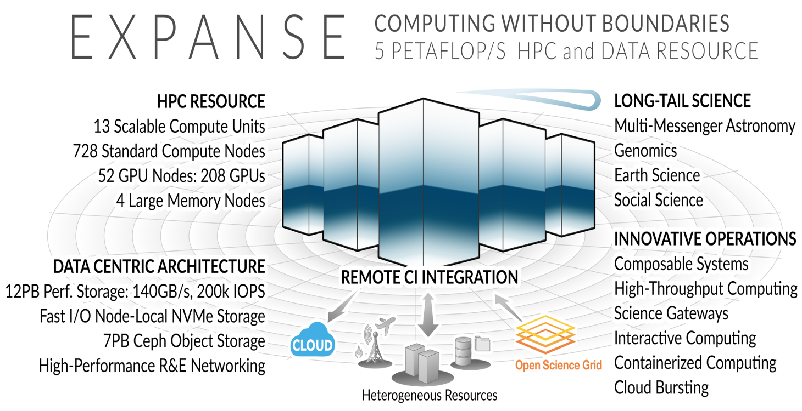
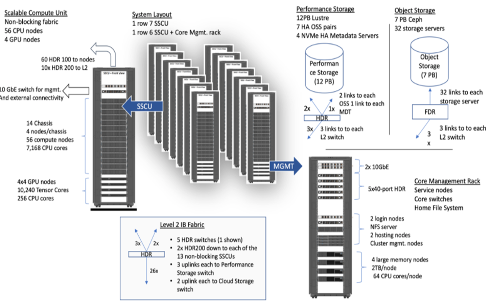

## Expanse Overview:

### HPC for the *long tail* of science:
* Designed by Dell and SDSC delivering 5.16 peak petaflops
* Designed and operated on the principle that the majority of computational research is performed at modest scale: large number jobs that run for less than 48 hours, but can be computationally intensvie and generate large amounts of data.
* An NSF-funded system available through the eXtreme Science and Engineering Discovery Environment (XSEDE) program (https://www.xsede.org).
* Supports interactive computing and science gateways.
* Will offer Composible Systems and Cloud Bursting.

### System Summary

* 13 SDSC Scalable Compute Units (SSCU)
* 728 x 2s Standard Compute Nodes
* 93,184 Compute Cores
* 200 TB DDR4 Memory
* 52x 4-way GPU Nodes w/NVLINK
* 208 V100s
* 4x 2TB Large Memory Nodes
* HDR 100 non-blocking Fabric
* 12 PB Lustre High Performance
* Storage
  * 7 PB Ceph Object Storage
  * 1.2 PB on-node NVMe
* Dell EMC PowerEdge
* Direct Liquid Cooled

[Back to Top](#top)

