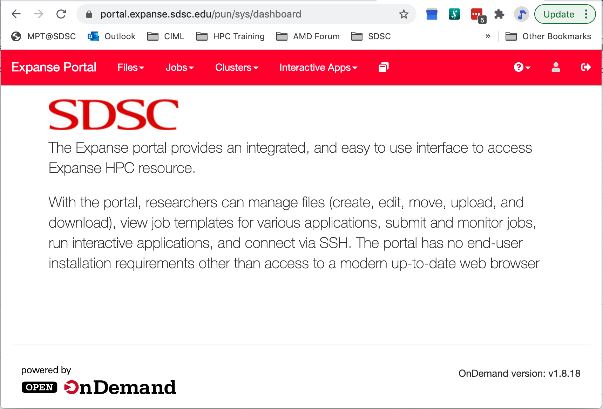

## Getting Started on Expanse
This page covers accounts, login, example code, and the Expanse user portal.

---

### Expanse Accounts
* You must have a expanse account in order to access the system.
* To obtain an account, users may submit a proposal through the [ACCESS Allocation Request System](https://access-ci.atlassian.net/)  or request a Trial Account from SDSC: consult@sdsc.edu.
   * For more details, see https://www.sdsc.edu/support/user_guides/expanse.html#access
* If you had an XSEDE account, it should have been migrated to the ACCESS System. For details, see: https://identity.access-ci.org/new-user
* Interested parties may contact the ACCESS Help Desk for help with an Expanse proposal. See: https://access-ci.atlassian.net/wiki/spaces/ACCESSdocumentation/pages/72417292

### Logging Onto Expanse

Expanse supports Single Sign-On through the ACCESS Identity System (see: https://identity.access-ci.org/new-user), from the command line using an ACCESS-wide password. While CPU and GPU resources are allocated separately, the login nodes are the same. To log in to Expanse from the command line, use the hostname:

```
login.expanse.sdsc.edu
```

The following are examples of Secure Shell (ssh) commands that may be used to log in to Expanse:

```
ssh <username>@login.expanse.sdsc.edu
ssh -l <username> login.expanse.sdsc.edu
```
Details about how to access Expanse under different circumstances are described in the Expanse User Guide:
https://www.sdsc.edu/support/user_guides/expanse.html#access

For instructions on how to use SSH,
see [Connecting to SDSC HPC Systems Guide](https://github.com/sdsc-hpc-training-org/hpc-security). Below is the logon message – often called the *MOTD* (message of the day, located in /etc/motd). This has not been implemented at this point on Expanse

```
[username@localhost:~] ssh -Y username@login.expanse.sdsc.edu
Welcome to Bright release         9.0

                                                         Based on Rocky Linux 8
                                                                    ID: #000002
--------------------------------------------------------------------------------

                                 WELCOME TO
                  _______  __ ____  ___    _   _______ ______
                 / ____/ |/ // __ \/   |  / | / / ___// ____/
                / __/  |   // /_/ / /| | /  |/ /\__ \/ __/
               / /___ /   |/ ____/ ___ |/ /|  /___/ / /___
              /_____//_/|_/_/   /_/  |_/_/ |_//____/_____/

--------------------------------------------------------------------------------

Use the following commands to adjust your environment:

'module avail'            - show available modules
'module add <module>'     - adds a module to your environment for this session
'module initadd <module>' - configure module to be loaded at every login

-------------------------------------------------------------------------------
Last login: Mon Apr 10 15:47:22 2023 from 12.34.56.789

```

#### Example of a terminal connection/Unix login session:

```
localhost:~ user$ sssh -Y username@login.expanse.sdsc.edu
Last login: Mon Apr 10 15:47:22 2023 from 12.34.56.789
[username@login02 ~]$
[username@login02 ~]$ whoami
username
[username@login02 ~]$ hostname
login01
[username@login02 ~]$ pwd
/home/username
[username@login02 ~]$
```
---
### Obtaining Tutorial Example Code
We will clone the example code from GitHub repository using anonymous HTTPS downloads from GitHub. 
https://github.com/sdsc-hpc-training-org/hpctr-examples.git

Note that GitHub has increased it's security requirements, and you may have to deal with that. See: https://docs.github.com/en/authentication

* Create a test directory hold the expanse example files (optional):

```
[username@login01] ~]$ git clone https://github.com/sdsc-hpc-training-org/expanse-101.git
Cloning into 'hpctr-examples'...
Warning: untrusted X11 forwarding setup failed: xauth key data not generated
remote: Enumerating objects: 352, done.
remote: Counting objects: 100% (352/352), done.
remote: Compressing objects: 100% (227/227), done.
remote: Total 352 (delta 128), reused 334 (delta 119), pack-reused 0
Receiving objects: 100% (352/352), 27.62 MiB | 19.88 MiB/s, done.
Resolving deltas: 100% (128/128), done.
Updating files: 100% (310/310), done.
[username@login01] ~]$ cd hpctr-examples/
[username@login01] hpctr-examples]$ ll
total 272
drwxr-xr-x 12 username use300    15 Apr 10 22:26 .
drwxr-x--- 41 username use300    63 Apr 10 22:26 ..
drwxr-xr-x  9 username use300    10 Apr 10 22:26 basic_par
drwxr-xr-x  3 username use300     9 Apr 10 22:26 calc-prime
drwxr-xr-x  6 username use300     7 Apr 10 22:26 cuda
drwxr-xr-x  2 username use300     5 Apr 10 22:26 env_info
drwxr-xr-x  8 username use300    13 Apr 10 22:26 .git
-rw-r--r--  1 username use300  1799 Apr 10 22:26 .gitignore
drwxr-xr-x  2 username use300     9 Apr 10 22:26 hybrid
-rw-r--r--  1 username use300 35149 Apr 10 22:26 LICENSE
drwxr-xr-x  4 username use300     4 Apr 10 22:26 mkl
drwxr-xr-x  2 username use300    15 Apr 10 22:26 mpi
drwxr-xr-x  2 username use300    17 Apr 10 22:26 openacc
drwxr-xr-x  2 username use300     8 Apr 10 22:26 openmp
-rw-r--r--  1 username use300  5772 Apr 10 22:26 README.md

```

*Note*: you can learn to create and modify directories as part of the *Getting Started* and *Basic Skills* preparation found here:
https://github.com/sdsc-hpc-training-org/basic_skills

The examples directory contains the code we will cover in this tutorial:

```
[username@login01] examples]$ ll
total 141
drwxr-xr-x 9 user abc123  9 Jan 28 22:44 .
drwxr-xr-x 5 user abc123  10 Jan 28 22:44 ..
drwxr-xr-x 6 user abc123   7 Jan 28 22:44 CUDA
drwxr-xr-x 6 user abc123   7 Jan 28 22:39 cuda-samples
drwxr-xr-x 2 user abc123   3 Jan 28 22:39 ENV_INFO
drwxr-xr-x 2 user abc123   6 Jan 28 22:39 HYBRID
drwxr-xr-x 2 user abc123   6 Jan 28 22:39 MPI
drwxr-xr-x 2 user abc123   6 Jan 28 22:39 OpenACC
drwxr-xr-x 2 user abc123   6 Jan 28 22:39 OPENMP

```
All examples will contain source code, along with a batch script example so you can compile and run all examples on Expanse. Optionally, you can clone the tutorial as well:   https://github.com/sdsc-hpc-training-org/expanse-101.git

---
### Expanse User Portal



The Expanse User portal provides a quick and easy way for Expanse users . Features include:
* Logging in, transfering and editing files
* Submitting and monitoring jobs
* Running HPC applications
* Launching interactive applications such as MATLAB, Rstudio and Jupyter Notebooks.
* Integrated web-based environment for file management and job submission.
* All Users with valid Expanse Allocation and ACCESS Based credentials have access via their ACCESS credentials..
* See: https://portal.expanse.sdsc.edu

Note that before you can access the Expanse Portal, you will need to authenticate (as shown in the image below). Most users will select the organization labeled "ACCESS CI (formerly XSEDE)" for login. Contact SDSC consulting (consult@sdsc.edu) if you have trouble authenticating.


---
